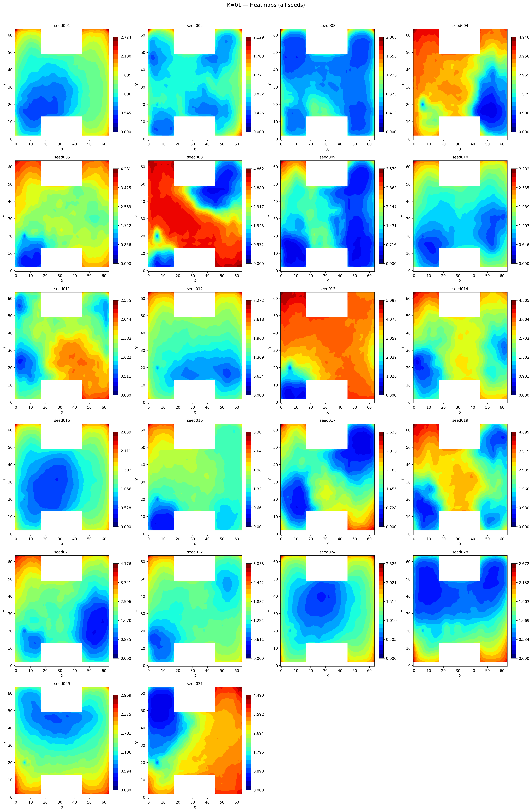
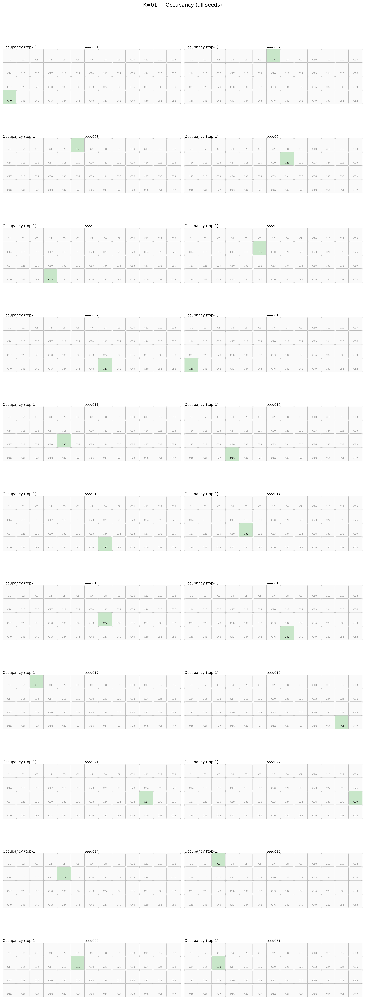

# Latent Optimization Report

Run folder: `/home/ubuntu/gan/Latent_opm/runs/latent_opt_checkpoint_epoch_400_20260420_120119`

## K = 01

### Impedance

### Heatmaps

### Occupancy

## K = 02

### Impedance

### Heatmaps

### Occupancy

## K = 03

### Impedance

### Heatmaps

### Occupancy

## K = 04

### Impedance

### Heatmaps

### Occupancy

## K = 05

### Impedance

### Heatmaps

### Occupancy

## K = 06

### Impedance

### Heatmaps

### Occupancy

## K = 07

### Impedance

### Heatmaps

### Occupancy

## K = 08

### Impedance

### Heatmaps

### Occupancy

## K = 09

### Impedance

### Heatmaps

### Occupancy

## K = 10

### Impedance

### Heatmaps

### Occupancy

## K = 11

### Impedance

### Heatmaps

### Occupancy

## K = 12

### Impedance

### Heatmaps

### Occupancy

## K = 13

### Impedance

### Heatmaps

### Occupancy

## K = 14

### Impedance

### Heatmaps

### Occupancy

## K = 15

### Impedance

### Heatmaps

### Occupancy

## K = 16

### Impedance

### Heatmaps

### Occupancy

## K = 17

### Impedance

### Heatmaps

### Occupancy

## K = 18

### Impedance

### Heatmaps

### Occupancy

## K = 19

### Impedance

### Heatmaps

### Occupancy

## K = 20

### Impedance

### Heatmaps

### Occupancy

## K = 21

### Impedance

### Heatmaps

### Occupancy

## K = 22

### Impedance

### Heatmaps

### Occupancy

## K = 23

### Impedance

### Heatmaps

### Occupancy

## K = 24

### Impedance

### Heatmaps

### Occupancy

## K = 25

### Impedance

### Heatmaps

### Occupancy

## K = 26

### Impedance

### Heatmaps

### Occupancy

## K = 27

### Impedance

### Heatmaps

### Occupancy

## K = 28

### Impedance

### Heatmaps

### Occupancy

## K = 29

### Impedance

### Heatmaps

### Occupancy

## K = 30

### Impedance

### Heatmaps

### Occupancy

## K = 31

### Impedance

### Heatmaps

### Occupancy

## K = 32

### Impedance

### Heatmaps

### Occupancy

## K = 33

### Impedance

### Heatmaps

### Occupancy

## K = 34

### Impedance

### Heatmaps

### Occupancy

## K = 35

### Impedance

### Heatmaps

### Occupancy

## K = 36

### Impedance

### Heatmaps

### Occupancy

## K = 37

### Impedance

### Heatmaps

### Occupancy

## K = 38

### Impedance

### Heatmaps

### Occupancy

## K = 39

### Impedance

### Heatmaps

### Occupancy

## K = 40

### Impedance

### Heatmaps

### Occupancy

## K = 41

### Impedance

### Heatmaps

### Occupancy

## K = 42

### Impedance

### Heatmaps

### Occupancy

## K = 43

### Impedance

### Heatmaps

### Occupancy

## K = 44

### Impedance

### Heatmaps

### Occupancy

## K = 45

### Impedance

### Heatmaps

### Occupancy

## K = 46

### Impedance

### Heatmaps

### Occupancy

## K = 47

### Impedance

### Heatmaps

### Occupancy

## K = 48

### Impedance

### Heatmaps

### Occupancy

## K = 49

### Impedance

### Heatmaps

### Occupancy

## K = 50

### Impedance

### Heatmaps

### Occupancy

## K = 51

### Impedance

### Heatmaps

### Occupancy

## K = 52

### Impedance

### Heatmaps

### Occupancy

