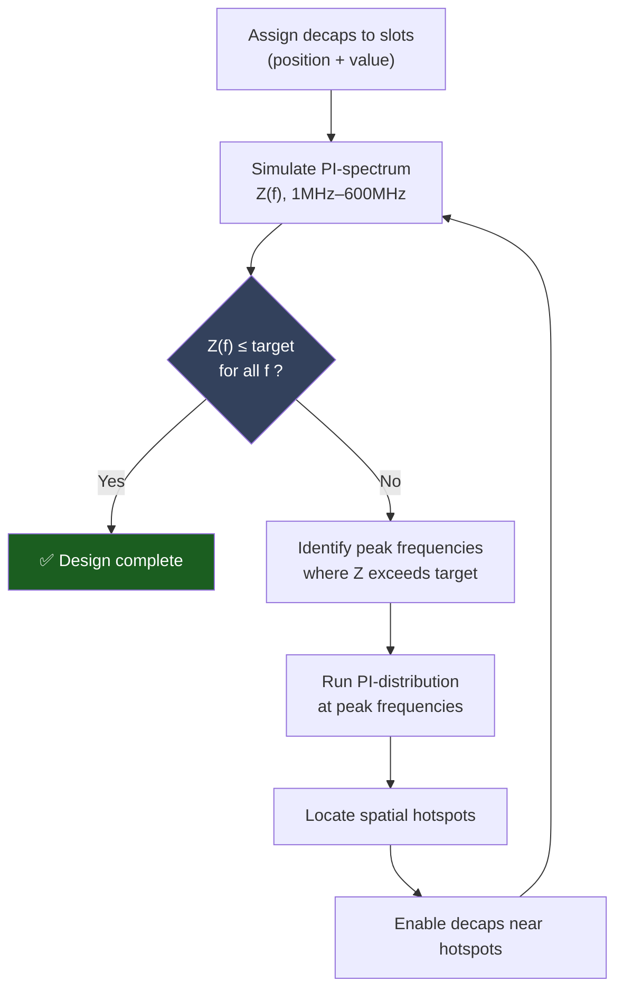
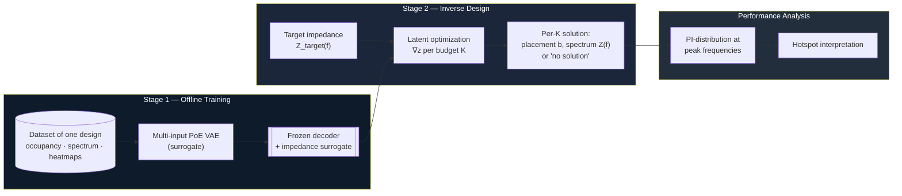
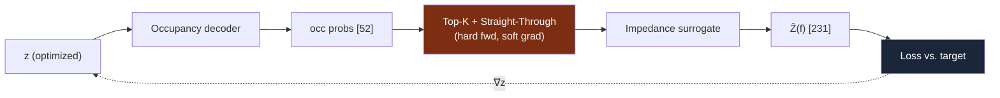
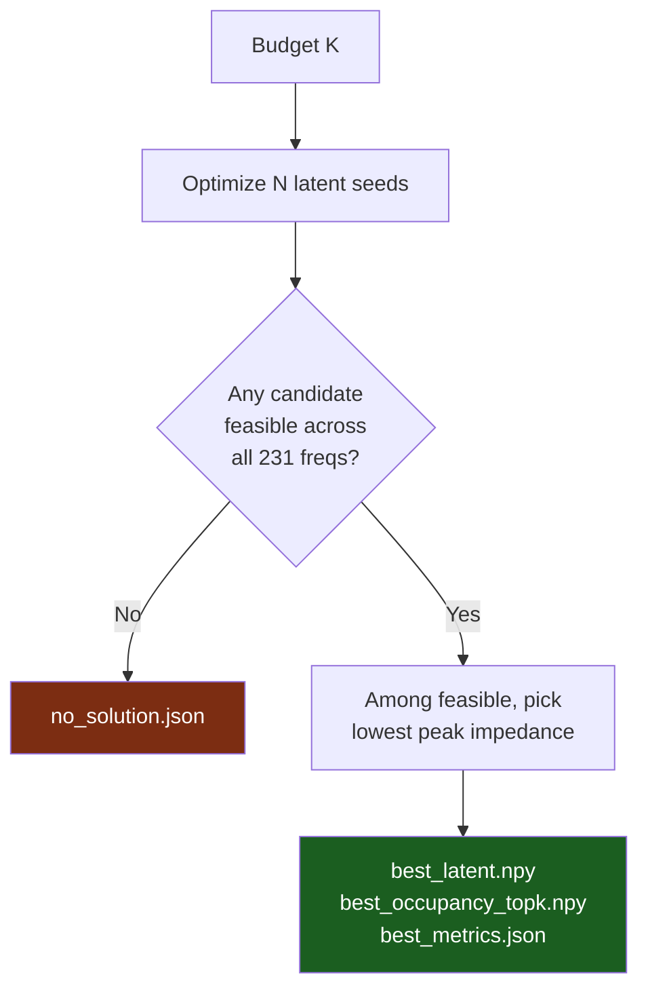

# A Generative AI Framework for the Design Optimization and Performance Analysis of PCB Power Delivery Networks

## A surrogate-driven inverse-design approach to decoupling-capacitor placement

---

## Abstract

The design of a Printed Circuit Board (PCB) **Power Delivery Network (PDN)** requires placing
**decoupling capacitors (decaps)** so that the power-rail impedance seen by an integrated circuit
stays below a frequency-dependent target across the operating band. With dozens of candidate slots,
the configuration space is combinatorial — for a board with 52 slots there are $2^{52}\approx
4.5\times10^{15}$ possibilities — and there is no closed-form mapping from a placement to its
impedance response. In practice, engineers converge on a solution through a slow, manual
loop of *place → simulate → inspect spectrum → locate spatial hotspots → adjust*.

This project develops a **generative-AI framework** that learns this design space from data and
reformulates the search as a continuous inverse-design problem. A multi-input, **product-of-experts
Variational Autoencoder (VAE)** with **graph encoders** and a **structured latent space** is trained
as a differentiable **surrogate** of a single board, jointly modelling (i) the decap occupancy vector,
(ii) the PI-spectrum (impedance magnitude vs. frequency), and (iii) the spatial **PI-distribution**
hotspot maps at a set of frequency anchors, conditioned on the decap budget $K$ and the inspection
frequency. The current model is **`exp059_capacity_freq`** (128-d structured latent, multi-scale FiLM).
With the decoder frozen, **gradient-based latent optimization** then searches the learned latent space
for configurations whose predicted spectrum meets a target, returning — for each decap budget $K$ —
the feasible placement with the lowest peak impedance, or reporting that no feasible solution exists.
An **active-learning loop** can fine-tune the surrogate on newly simulated high-uncertainty layouts.
The result is a **decision-support tool** that proposes physically meaningful starting points for the
engineer's iterative process, collapsing an intractable combinatorial search into a handful of
gradient descents.

---

## Table of Contents

1. [Motivation & Problem Statement](#1-motivation--problem-statement)
2. [The Conventional Engineering Loop](#2-the-conventional-engineering-loop)
3. [Proposed Framework](#3-proposed-framework)
4. [Stage 1 — Generative Surrogate (VAE)](#4-stage-1--generative-surrogate-vae)
5. [Stage 2 — Latent Optimization](#5-stage-2--latent-optimization)
6. [Performance Analysis Layer](#6-performance-analysis-layer)
7. [Repository Structure](#7-repository-structure)
8. [Tier-1 MLOps Stack](#8-tier-1-mlops-stack)
9. [Dataset](#9-dataset)
10. [Installation & Usage](#10-installation--usage)
11. [Limitations & Future Work](#11-limitations--future-work)
12. [What is Tracked in This Repository](#12-what-is-tracked-in-this-repository)

**Current version:** `exp059_capacity_freq` (Aug 2026) — 128-d structured latent, occupancy + spectrum GNNs,
multi-scale FiLM heatmap decoder, residual-GP active learning. `exp057`/`exp058` are legacy;
`exp060_multitype_occ` is an exploratory fork for multi-type (one-hot) occupancy.

> **Accompanying thesis.** The written thesis lives in [`Thesis_report/`](Thesis_report/)
> (`thesis_v3.tex` + `chapters/`). Chapters 1–3 and Appendices A–B are drafted; Chapter 4
> (Results), Chapter 5 (Conclusion) and Appendix C depend on experiments not yet run.

---

## 1. Motivation & Problem Statement

A PDN must keep the impedance $Z(f)$ seen at the IC below a **target impedance mask** $Z_\text{target}(f)$
over the band of interest (here **1 MHz – 600 MHz**, sampled at 231 points). Decaps lower impedance
locally in frequency and space, but their effect is coupled and non-linear. The designer's lever is a
binary placement vector

$$
\mathbf{b}\in0,1^{52},\qquad \mathbf{b}_0 = K,
$$

where each entry selects whether a slot is populated and $K$ is the **decap budget** (a cost/area
constraint). The goal is to find a placement that is *feasible*,

$$
Z(f;\mathbf{b}) \le Z_\text{target}(f)\quad\forall f,
$$

while keeping $K$ small. Because the forward map $\mathbf{b}\mapsto Z(\cdot)$ is only available
through an expensive field solver and the domain $0,1^{52}$ is astronomically large, exhaustive
or even heuristic search is impractical. **This work replaces the forward solver with a learned,
differentiable surrogate and the discrete search with continuous optimization.**

---

## 2. The Conventional Engineering Loop



Each pass through this loop costs a full electromagnetic simulation, and the number of passes grows
with board complexity. The framework below **amortizes** this loop into a one-shot proposal step.

---

## 3. Proposed Framework

The framework has two stages plus an analysis layer, all built around a single trained surrogate.
The full pipeline is summarized below.



| Stage                  | Input                    | Output                           | Code                                                                 |
| ---------------------- | ------------------------ | -------------------------------- | -------------------------------------------------------------------- |
| 1. Surrogate training  | dataset (one design)     | frozen VAE + impedance surrogate | `[experiments/exp059_capacity_freq/](experiments/exp059_capacity_freq/)` |
| 2. Latent optimization | target $Z_\text{target}$ | best placement per $K$           | `[pipelines/latent/optimize.py](pipelines/latent/optimize.py)`       |
| 3. Analysis            | a solution               | PI-distribution hotspot maps     | VAE heatmap decoder                                                  |
| 4. Active learning     | surrogate uncertainty    | new sim labels + fine-tuned VAE  | `[pipelines/active_learning/run.py](pipelines/active_learning/run.py)` |

---

## 4. Stage 1 — Generative Surrogate (VAE)

The **current model** is **`exp059_capacity_freq`**: a multi-input Variational Autoencoder with a
**structured latent** $\mathbf z\in\mathbb R^{128}$ (80 shared + 8 peak + 40 spatial), **graph neural
network (GNN)** encoders for occupancy (52-slot PCB grid) and impedance (231-bin spectrum chain), and a
**Product-of-Experts (PoE)** posterior. Conditioning signals are the decap budget $K$ and (for the
spatial head) the inspection **frequency**, injected by **FiLM at every decoder scale**.

Decoder inputs differ per head: the occupancy decoder sees the shared latent plus conditioning; the
impedance decoder additionally sees the peak dimensions and a 64-d occupancy graph context; the
heatmap decoder sees the full latent.

Earlier experiments (`exp043` PoE baseline → `exp054` self-contained training → `exp055` binary
occupancy decode → `exp056` occupancy GNN → `exp057` structured latent + spectrum GNN → `exp058`
asymmetric KL → `exp059` capacity + frequency FiLM) are kept under `experiments/` for comparison.
See [`docs/model-architecture.md`](docs/model-architecture.md) for architecture details.

> **Two-phase configuration.** `config.yaml` is the *capacity* phase; `config_al_finetune.yaml`
> holds the active-learning fine-tune overrides. AL scoring needs the occupancy→heatmap path, so a
> pure capacity checkpoint is not AL-ready without that fine-tune.

### 4.1 Modalities

| Modality                      | Tensor shape    | Role                                                    |
| ----------------------------- | --------------- | ------------------------------------------------------- |
| Decap **occupancy**           | `[52]`          | binary placement (which slots are populated)            |
| **PI-spectrum** (magnitude)   | `[231]`         | impedance vs. frequency, 1–600 MHz                      |
| **PI-distribution** (heatmap) | `[64 × 64 × 1]` | spatial hotspot map at a frequency anchor (24 anchors) |

### 4.2 Product-of-Experts encoder

Each modality has its own encoder producing a Gaussian "expert" $\mathcal N(\mu_m,\sigma_m^2)$ over
the latent. A dedicated **frequency expert** writes the heatmap-private latent dimensions from the
frequency-conditioning vector alone. Experts are fused by multiplication (PoE):

$$
\mu_\text{PoE}=\frac{\sum_m \mu_m/\sigma_m^2}{\sum_m 1/\sigma_m^2},
\qquad
\sigma_\text{PoE}^{2}=\frac{1}{\sum_m 1/\sigma_m^2}.
$$

**Modality dropout** during training forces any subset of experts to reconstruct the whole, which is
what makes the *occupancy-only* encoding path usable at inference (we only know the placement, not
the spectrum, when proposing designs).


Architecture: `[vae_poe_freq.py](experiments/exp059_capacity_freq/codes/vae_poe_freq.py)`,
`[graph_occ.py](experiments/exp059_capacity_freq/codes/graph_occ.py)` (PCB-slot GNN),
`[graph_imp.py](experiments/exp059_capacity_freq/codes/graph_imp.py)` (spectrum-chain GNN).
Hyperparameters (`latent_dim=128`, `heatmap_private_dim=40`, `cond_dim=32`,
`freq_fourier_features=16`, binary occupancy decode, multi-scale FiLM heatmap head) are in
`[config.yaml](experiments/exp059_capacity_freq/config.yaml)` — 183 keys, all tabulated in
Appendix B of the thesis. Note the file is **JSON despite the `.yaml` extension**.

> **Configured but not active in exp059.** Two loss terms are implemented and weighted in config yet
> never reach the objective: the **physics regularizers** (`physics_ri/critic_sup/ar`) — the live
> epoch function passes `physics=None` — and the **spectral anti-blur loss**, whose weight key is
> absent so it defaults to `0.0`. Treat exp059 as *not* physics-informed in its training objective.

### 4.3 Impedance surrogate

For Stage 2 we additionally use a small **occupancy → impedance** surrogate network
(`surrogate_impedance.py`), which maps a *hard binary* placement directly to its predicted spectrum.
It is the most accurate forward model for the optimizer because it is trained on, and queried with,
exactly the discrete placements the optimizer reads out.

> **Scope.** `surrogate_impedance.py` exists only in the legacy forks `exp037`–`exp041`, not in
> exp059. Stage 2 has not been rebuilt against the current model — see §5 and §10.

---

## 5. Stage 2 — Latent Optimization

With every network frozen, we optimize the latent vector $\mathbf z$ so that the **decoded
placement's predicted spectrum** meets the target. The forward chain per step is:



### 5.1 The straight-through estimator (key detail)

Reading out exactly $K$ decaps requires a **hard top-$K$** on the occupancy probabilities — a
discrete operation with no gradient. A naïve implementation severs the computational graph, so the
spectrum loss cannot move $\mathbf z$ and the "optimization" degenerates into random seed sampling.
We restore the gradient with a **straight-through estimator**:

$$
\text{topK}*\text{STE}(\mathbf p) = \underbrace{\text{hardtopK}(\mathbf p)}*{\text{forward value}}

- \underbrace{\mathbf p - \text{sg}(\mathbf p)}_{\text{identity gradient}},
$$

where $\text{sg}(\cdot)$ is stop-gradient. The surrogate therefore always sees an in-distribution
binary vector with exactly $K$ ones, while $\partial \mathcal L/\partial \mathbf z$ flows back through
the continuous occupancy. (See `_ste_topk` in the optimizer.)

### 5.2 Objective

For each budget $K$, multiple latent seeds are optimized in parallel with Adam. The composite loss
balances target satisfaction, spectral shape, manifold adherence, and candidate diversity:

$$
\mathcal L = \underbrace{\lambda_\text{ex}\mathcal L_\text{exceed} - \lambda_\text{gap}\mathcal L_\text{gap}}_{\text{meet the target}}

- \underbrace{\lambda_\text{peak}\mathcal L_\text{peak} + \lambda_\text{track}\mathcal L_\text{track} + \lambda_\text{ar}\mathcal L_\text{anti-res}}_{\text{spectral shape  physics}}
- \underbrace{\lambda_\text{z}\mathcal L_\text{prior} + \lambda_\text{b}\mathcal L_\text{boundary}}_{\text{stay on manifold}}
- \lambda_\text{div}\mathcal L_\text{div}.
$$

- **Exceed / gap** — penalize any frequency above $Z_\text{target}-\text{margin}$; reward headroom below.
- **Peak / track** — align the largest resonance peaks (index + magnitude, dual top-$K$) with the target.
- **Anti-resonance** — a physics prior discouraging spurious series-resonance dips.
- **Prior / boundary** — keep $\mathbf z$ within the aggregate posterior so the surrogate stays trustworthy (guards against adversarial off-manifold solutions).
- **Diversity** — push parallel seeds toward distinct placements.

### 5.3 Selection rule



For each $K$ the optimizer returns the single feasible latent with the **lowest peak impedance**
($\min$ over candidates of $\max_f \hat Z(f)$), or an explicit **no-solution** record when no seed
satisfies the target — exactly the decision an engineer needs when a budget is simply too small.

---

## 6. Performance Analysis Layer

Given a proposed placement, the VAE's **frequency-conditioned heatmap decoder** regenerates the
spatial **PI-distribution** at the spectrum's peak frequencies, reproducing the hotspot view the
engineer would normally obtain from a separate field simulation. This closes the interpretability
loop: the framework not only *proposes* a placement but also *explains* where the remaining risk
concentrates spatially.

> **Validity note.** Both the proposed spectrum and these heatmaps are *surrogate predictions*. A
> proposed design should be re-verified with the ground-truth PI solver before adoption; the
> framework's role is to produce high-quality candidates, not to replace final sign-off.

---

## 7. Repository Structure

Scripts are grouped under **`pipelines/`** and **`libs/`**. Path helpers live in
`[repo_paths.py](repo_paths.py)`; see path helpers and migration notes are summarized in
`[docs/data-pipeline.md](docs/data-pipeline.md)` (archive: `docs/_archive/FOLDER_RENAME_AND_PATHS.md`).

```text
.
├── pipelines/                   Runnable workflows (edit CONFIG, then python …)
│   ├── data/                    Build datasets from raw ECAD exports
│   ├── dataset/                 Manifest transforms, subsample, gmax
│   ├── dataset_sim/             ECAD append queue, combination sim, output moves
│   ├── normalize/               Normalization & stats
│   ├── analysis/                Latent traversal, QA utilities
│   ├── visualize/               Heatmap & impedance plotting
│   ├── latent/                  Stage-2 optimization & reports
│   ├── heatmaps/                PEB frequency & combination tools
│   └── active_learning/         Active-learning entry (run.py)
├── libs/                        Shared import-only modules
│   ├── data_creation/           heatmap, impedance, occupancy, csv_to_occupancy
│   ├── dataset_meta.py          dataset_meta.json helpers
│   └── peb/                     PEB frequency regex helper
├── experiments/                 Generative surrogate experiments (exp001 … exp060)
│   ├── exp043/                  PoE VAE baseline (frequency expert, FiLM heatmap)
│   ├── exp054_K_30/             Self-contained training loop, K≤30 filter
│   ├── exp055_hard_occ/         Binary top-K occupancy decode
│   ├── exp056_graph_vae/        Occupancy GNN on 52-slot PCB grid
│   ├── exp057_structured_graph/ Structured 65-d latent + spectrum GNN (legacy)
│   ├── exp058_asymmetric_kl/    Asymmetric KL study (legacy)
│   ├── exp060_multitype_occ/    Multi-type one-hot occupancy 52×T (exploratory)
│   └── exp059_capacity_freq/    ← current model
│       ├── codes/
│       │   ├── vae_poe_freq.py        PoE VAE with structured latent
│       │   ├── graph_occ.py           occupancy GNN encoder/decoder
│       │   ├── graph_imp.py           spectrum-chain GNN encoder/decoder
│       │   ├── train_vae_simple.py    training entry point
│       │   └── eval_off_anchor.py     off-anchor spatial metrics
│       ├── config.yaml                hyperparameters (capacity phase)
│       └── config_al_finetune.yaml    active-learning fine-tune overrides
├── Thesis_report/               Written thesis (LaTeX)
│   ├── thesis_v3.tex            master file
│   ├── chapters/                ch1–ch5 + appendices A–B
│   └── refs.bib                 bibliography
├── active_learning_pi/          Active-learning library + run configs
│   ├── al/                      pipeline, ingest, normalize, finetune, GP surrogate
│   ├── config/exp059_gp_error.json  primary AL config (residual-GP acquisition)
│   └── runs/                    per-cycle decision reports and evaluations
├── scrap/                       Sample generation, comparison, orchestration
│   ├── generation/
│   ├── comparison/
│   └── orchestration/           End-to-end multifreq sweep pipelines
├── datasets/                    Training data (not committed — see §8)
├── data_multi_norm_robust/      Robust-normalized cache (not committed)
├── data/
│   ├── heatmaps/                PEB files, all_combinations.csv, decap maps
│   └── latent_runs/             Latent optimization outputs
├── configs/                     target_impedance.npy, frequency grid, masks
├── tools/                       Path migration, docstring helpers, ECADSTAR utils
├── docs/                        Experiment notes, pipeline guides, figures
├── repo_paths.py                Repo-root path helpers (REPO_ROOT, repo_path)
├── evaluation/                  Novelty / quality evaluation of generated samples
├── src_vae/                     Shared VAE training library
└── viewer/                      Result viewers
```

### Experiment lineage (selected)

| Experiment | Key change |
| ---------- | ---------- |
| `exp043` | PoE multi-input VAE + frequency expert (baseline) |
| `exp054_K_30` | Self-contained training; K≤30 unbounded dataset |
| `exp055_hard_occ` | Hard top-K occupancy before heatmap decode |
| `exp056_graph_vae` | GNN occupancy encoder/decoder on PCB grid |
| `exp057_structured_graph` | Structured 65-d latent + spectrum GNN + occ↔imp coupling (legacy) |
| `exp058_asymmetric_kl` | Asymmetric KL weighting study (legacy) |
| `exp059_capacity_freq` | **Current.** 128-d latent, multi-scale FiLM, residual-GP AL |
| `exp060_multitype_occ` | Multi-type one-hot occupancy `52×T` (exploratory) |

### Common entry points

| Task                          | Command                                                      |
| ----------------------------- | ------------------------------------------------------------ |
| Build multifreq dataset       | `python pipelines/data/processing_multifreq.py`              |
| Normalize dataset             | `python pipelines/normalize/multifreq.py`                    |
| Train surrogate (exp059)      | `python -m experiments.exp059_capacity_freq.codes.train_vae_simple` |
| Latent optimization (Stage 2) | `python pipelines/latent/optimize.py`                        |
| Feasibility sampling          | `python pipelines/latent/find_feasible.py`                   |
| Active-learning cycle         | `python pipelines/active_learning/run.py`                    |
| Acquisition A/B (no new ECAD) | `python active_learning_pi/al/validate_acquisition_ab.py`    |
| Multifreq sweep               | `python scrap/orchestration/run_multifreq_sweep_pipeline.py` |
| ECAD append pipeline          | `python pipelines/dataset_sim/run_combinations_sim_pipeline.py` |

All pipeline scripts use a **CONFIG block** at the top of the file — edit constants, then run with `python <path>`. Each script's docstring includes **Agent notes** (What, Usage, Config keys). See `[pipelines/README.md](pipelines/README.md)`.

---

## 8. Tier-1 MLOps Stack

This repository includes a **production-ready MLOps stack** built around `exp059_capacity_freq`:

| Module | Purpose | Files |
|--------|---------|-------|
| **1. Pydantic** | Config validation (catch typos immediately) | `experiments/exp059_capacity_freq/codes/config_schema.py` |
| **2. pytest** | 7 focused tests on critical math | `tests/test_*.py` (153 lines) |
| **3. Docker** | Reproducible training env (CUDA 11.8, Python 3.10, pinned deps) | `Dockerfile`, `pyproject.toml`, `.dockerignore` |
| **4. MLflow** | Experiment tracking + metrics UI | Modified `train_core.py`, `finetune_run.py` |
| **5. FastAPI** | HTTP inference service (`/predict` endpoint) | `serving/app.py`, `serving/schemas.py` |
| **6. GitHub Actions** | Automated CI (lint, test, docker build on every PR) | `.github/workflows/ci.yml` |

### Quick Start

**Train with Docker (reproducible environment):**
```bash
docker build -t genai-pdn:exp059 .
docker run --gpus all \
  -v /path/to/datasets:/app/datasets \
  -v /path/to/checkpoints:/app/experiments/exp059_capacity_freq/checkpoints \
  genai-pdn:exp059
```

**Run tests (safety net):**
```bash
pip install -e . --no-deps && pip install pytest pydantic torch numpy
pytest tests/ -v
```

**Track experiments:**
```bash
mlflow server --backend-store-uri sqlite:///mlflow.db &
# Run training, then browse http://localhost:5000
```

**Serve the surrogate:**
```bash
docker build -t genai-pdn-serve -f serving/Dockerfile .
docker run -p 8000:8000 genai-pdn-serve
curl -X POST http://localhost:8000/predict -H "Content-Type: application/json" \
  -d '{"occupancy": [...], "K": 26, "frequency_mhz": 200.0}'
```

### Full Documentation

See **[`docs/MLOPS-TIER1-BUILD.md`](docs/MLOPS-TIER1-BUILD.md)** for:
- Detailed technical explanations of each module
- Integration examples
- Common workflows
- Portfolio value (what employers see)
- Tier-2 tools (future: DVC, Hydra, Prefect, Evidently)

---

## 9. Dataset

Training data is **not committed** (size). Expected layout under `datasets/`:

```text
datasets/
├── data_multifreq_train/              raw multifreq export (688,477 rows / 29,499 layouts)
├── data_multifreq_train_norm_robust/    robust per-MHz normalization (median/IQR)
├── data_multifreq_train_norm_unbounded/ K≤30 filter (582,997 samples / 24,979 layouts) — used by exp054–exp060
├── data_multifreq_al_overlay_exp059/   active-learning overlay (built per AL cycle)
└── data_multifreq/                      legacy multifreq layout (if present)
    ├── dataset_meta.json    summary: layouts, sample count, PI MHz anchors
    ├── manifest.csv         one row per (layout, frequency) sample
    ├── layouts/             per-layout decap occupancy vectors
    ├── Imp/                 PI-spectrum magnitudes      [231]
    ├── PI_freq/             frequency-conditioning vectors
    ├── heatmap/             PI-distribution maps         [64×64]
    └── Occ_map/             occupancy maps
```

Each normalized tree includes `dataset_meta.json` and `normalization_stats.json`. The optimization
target is `configs/target_impedance.npy` (shape `[231]`).

Build scripts: `pipelines/data/processing_multifreq.py` → `pipelines/normalize/multifreq.py`.
PEB / combination assets live in `data/heatmaps/`. A local robust-normalized cache may also exist at
`data_multi_norm_robust/` (also not committed).

Example `dataset_meta.json` fields: `unique_layouts`, `manifest_rows`, `size.total_mb`,
`pi_frequencies_mhz`, `samples_per_mhz`. The 24 anchors are
`[10, 63, 80, 100, 120, 150, 170, 180, 200, 230, 250, 270, 280, 300, 330, 350, 370, 390, 400, 420,
430, 450, 470, 500]` MHz; every anchor carries 24,979 samples except **80 MHz (8,480)**.

Appendix A of the thesis documents the simulation environment, PEB export format and dataset
specification in full.

---

## 10. Installation & Usage

**Option 1: Local environment (pip)**
```bash
pip install -e .  # Install from pyproject.toml
```

**Option 2: Docker (recommended for reproducibility)**
```bash
docker build -t genai-pdn:exp059 .
docker run --gpus all genai-pdn:exp059
```

Tested with **PyTorch 2.7 (CUDA 11.8)**; a GPU is recommended for training.
Exact versions are pinned in `pyproject.toml` for reproducibility.

### Running scripts

Every pipeline and workflow script is **CONFIG-only**: open the file, edit the `# CONFIGURATION` block, then run `python path/to/script.py`. Module docstrings explain **What** each script does, **Usage**, and **Config keys**.

### Testing

Run the pytest suite (7 tests on config validation + critical math):
```bash
pytest tests/ -v
```

Runs: Pydantic config validation, STE top-K gradient flow, normalization round-trips. See `tests/` and `[docs/MLOPS-TIER1-BUILD.md](docs/MLOPS-TIER1-BUILD.md)` for details.

### Stage 1 — train the surrogate

```bash
export CUDA_VISIBLE_DEVICES=0
export VAE_EXPERIMENT_DIR=$(pwd)/experiments/exp059_capacity_freq
unset VAE_CONFIG_PATH
python -m experiments.exp059_capacity_freq.codes.train_vae_simple

# 2-GPU DDP
export CUDA_VISIBLE_DEVICES=0,1
torchrun --standalone --nproc_per_node=2 -m experiments.exp059_capacity_freq.codes.train_vae_simple
```

Training must be launched as a **module** (`-m`), not a file path. Resume from
`experiments/exp059_capacity_freq/checkpoints/last_model.pt` (set `resume_checkpoint` in config).
Checkpoints are **not** cross-loadable between experiments — architecture keys differ.

### Build & normalize a dataset (if starting from raw ECAD)

```bash
python pipelines/data/processing_multifreq.py
python pipelines/normalize/multifreq.py
```

### Stage 2 — inverse design

Edit the **CONFIGURATION** block at the top of `[pipelines/latent/optimize.py](pipelines/latent/optimize.py)`
(set `EXPERIMENT` and checkpoint paths — defaults to `exp038_true_multi` for the impedance surrogate),
then:

```bash
python pipelines/latent/optimize.py
```

Results are written to `data/latent_runs/<experiment>/<run-idx>/K##/` as `best_latent.npy`,
`best_occupancy_topk.npy`, `best_metrics.json`, or `no_solution.json`. A Markdown summary is
auto-generated via `pipelines/latent/generate_run_report.py`.

Selected knobs (constants in the CONFIG block):

| Constant              | Meaning                                  | Default   |
| --------------------- | ---------------------------------------- | --------- |
| `NUM_STEPS`           | Adam steps per K                         | 1200      |
| `LR`                  | learning rate                            | 5e-2      |
| `NUM_CANDIDATE_SEEDS` | parallel latent seeds per K              | 32        |
| `K_LIST`              | decap budgets to solve                   | 1 … 25    |
| `BOUNDARY_MARGIN`     | feasibility safety margin                | 0.1       |
| `SELECT_METRIC`       | ranking metric (`max_ohm` = lowest peak) | `max_ohm` |
| `USE_SURROGATE`       | use impedance surrogate vs. VAE decoder  | True      |

### Stage 2 — export to ECADSTAR & compare

After optimization, export samples and build a batch PEB, run PI simulation, then compare:

```bash
python pipelines/latent/export_peb.py
# … run ECADSTAR batch PI on latent_run.peb …
python pipelines/latent/compare_report.py
```

### Active learning (exp059 residual-GP loop)

Edit CONFIG in `[pipelines/active_learning/run.py](pipelines/active_learning/run.py)`; `CONFIG_PATH`
defaults to `active_learning_pi/config/exp059_gp_error.json`. Then:

```bash
python pipelines/active_learning/run.py
```

The default `COMMAND = "full"` runs eight steps: generate candidates → inference pool → select-bad
→ build PEB / simulate → ingest labels → build overlay → fine-tune → post-fine-tune evaluation, and
writes `DECISION_REPORT.md` + `decision_ledger.json` with PASS/FAIL/UNCERTAIN verdicts. Set
`PROPOSE_ONLY=True` to dry-run scoring with no ECAD and no fine-tune. Never run
`active_learning_pi/al/pipeline.py` directly — it delegates to `run.py`.

| AL config | Role |
| --------- | ---- |
| `exp059_gp_error.json` | **Primary** — residual-GP acquisition, `score_mode: mu` |
| `exp059_random.json`   | Equal-budget random control |
| `exp059.json`          | MC self-uncertainty acquisition |

Acquisition ranks candidates by a **Gaussian process fitted to the surrogate's own error**, not by
the VAE's self-reported uncertainty. See [`docs/gp-error-surrogate.md`](docs/gp-error-surrogate.md)
and [`active_learning_pi/GP_ERROR_SURROGATE_FRAMEWORK.md`](active_learning_pi/GP_ERROR_SURROGATE_FRAMEWORK.md).

> ECADSTAR runs on Windows and is driven headlessly from WSL; the simulation steps cannot run
> without that host.

---

## 10. Limitations & Future Work

- **Single design.** The surrogate is trained on one board; cross-design generalization (a
design-conditioned surrogate) is the natural next step.
- **Surrogate fidelity.** Feasibility is asserted in surrogate space. Ground-truth re-simulation
before sign-off remains mandatory; the active-learning loop (`pipelines/active_learning/`) partially
closes the loop by fine-tuning on newly simulated high-uncertainty layouts.
- **Stage-2 / Stage-1 alignment.** Latent optimization still defaults to `exp038_true_multi`
checkpoints; wiring it to exp059 requires matching occupancy decode and surrogate paths in
`pipelines/latent/optimize.py`. **No end-to-end inverse-design result on exp059 exists.**
- **Discrete read-out.** The STE relaxation makes the search gradient-guided, but the
occupancy and impedance decoders are separate heads; tightening their consistency remains an avenue
for improvement.
- **Inactive loss terms.** The physics regularizers and the spectral anti-blur loss are configured
but never enter exp059's objective (see §4). Any "physics-informed" claim applies to the Stage-2
anti-resonance prior, not to surrogate training.
- **Off-anchor evaluation is partly contaminated.** `eval_off_anchor_mhz = [155, 250, 265]`, but
**250 MHz is itself a training anchor** and carries the highest weight (3.0 of 8.0). Since
`best_off_anchor_model.pt` selects checkpoints on this metric, model selection inherits the overlap.
Only 155 and 265 MHz are genuinely held out.
- **Active-learning cycles are not reproducible.** The generated runtime config is overwritten each
launch and no per-iteration record stores `layout_train_prob`, so the mixing probabilities used by
the four completed cycles cannot be recovered from the repository.
- **Acquisition superiority is unproven.** The exp059 equal-budget A/B has not been run;
`acq_ab_gp_vs_mc` is recorded UNCERTAIN. No claim that GP acquisition beats MC or random is supported.

---

## 11. What is Tracked in This Repository

To keep the repository lightweight, the following are intentionally **excluded** (see `.gitignore`):

- `datasets/` — training data (`data_multifreq_train`, normalized variants, AL overlays, …)
- `data_multi_norm_robust/` — local robust-normalized cache (~7.5 GB)
- model checkpoints — `*.pt`, `checkpoints/` (regenerated by training)
- `*.peb` simulation exports — individual files reach 107 MB, above GitHub's 100 MB hard limit
- generated experiment figures (`experiments/**/*.png`), heatmap-sweep samples, and oversized
  `comparison_report_*.html` (embedded base64 images, 13–23 MB each)
- bulk active-learning artifacts under `active_learning_pi/runs/`: raw `.npy`/`.map` arrays
  (~7.8 GB), candidate pools (~1.6 GB), and per-sample manifests
- `src_gan/`, `temp_visuals/`, `ppt/`, `.cursor/`, `.github/`, virtual-environment and IDE folders,
  Python caches

Tracked: source code (`pipelines/`, `libs/`, `experiments/`, `src_vae/`, `active_learning_pi/`,
`scrap/`), configuration, documentation (`docs/`), the thesis (`Thesis_report/`), `data/` apart from
its `.peb` exports, and — importantly — the **active-learning decision artifacts**: `DECISION_REPORT.md`,
`decision_ledger.json`, `acquisition_rank_quality.json`, `eval_cycle_summary.json`,
`CYCLE_EVAL_REPORT.md` and `selected_for_simulation.csv`. Those are the records the thesis cites;
the raw arrays behind them are reproducible from the pipeline.

**Remote:** [github.com/kovarthanmuthusamy/pdn-genai-optimization](https://github.com/kovarthanmuthusamy/pdn-genai-optimization)

---

Research prototype — decision-support for PDN decap placement. Proposed designs require ground-truth simulation before sign-off.
