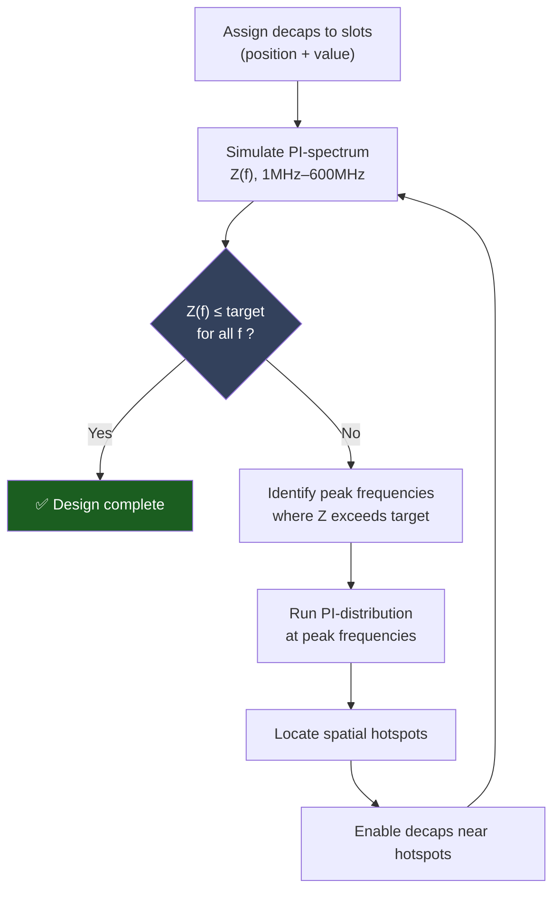
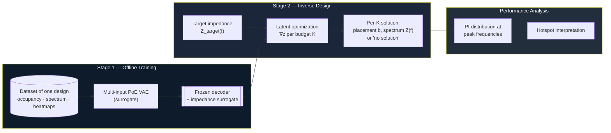
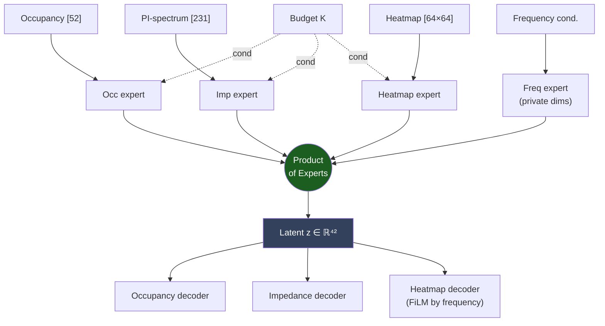
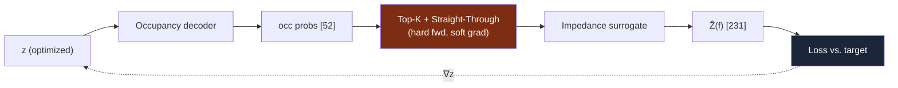
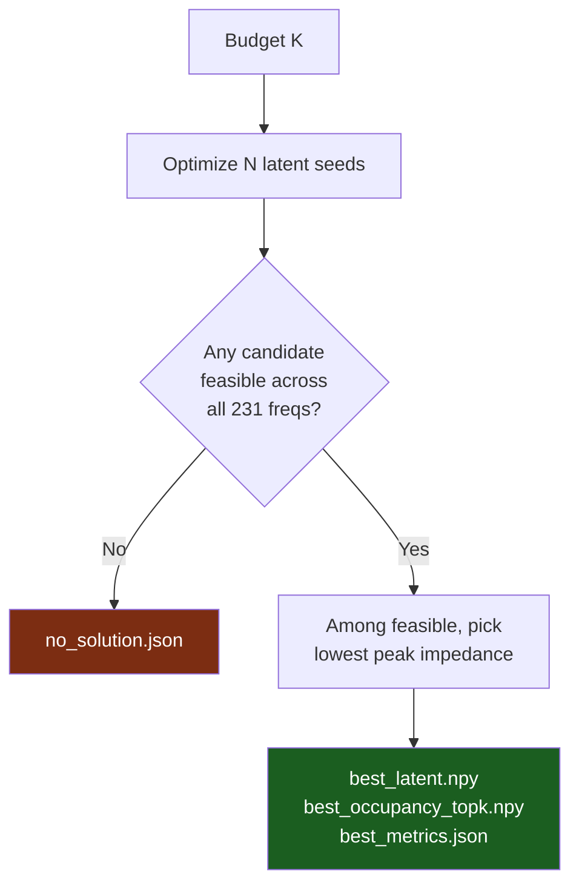

<div align="center">

# A Generative AI Framework for the Design Optimization and Performance Analysis of PCB Power Delivery Networks

*A surrogate-driven inverse-design approach to decoupling-capacitor placement*

</div>

---

## Abstract

The design of a Printed Circuit Board (PCB) **Power Delivery Network (PDN)** requires placing
**decoupling capacitors (decaps)** so that the power-rail impedance seen by an integrated circuit
stays below a frequency-dependent target across the operating band. With dozens of candidate slots,
the configuration space is combinatorial — for a board with 52 slots there are $2^{52}\approx
4.5\times10^{15}$ possibilities — and there is no closed-form mapping from a placement to its
impedance response. In practice, engineers converge on a solution through a slow, manual
loop of *place → simulate → inspect spectrum → locate spatial hotspots → adjust*.

This project develops a **generative-AI framework** that learns this design space from data and
reformulates the search as a continuous inverse-design problem. A multi-input, **product-of-experts
Variational Autoencoder (VAE)** is trained as a differentiable **surrogate** of a single board,
jointly modelling (i) the decap occupancy vector, (ii) the PI-spectrum (impedance magnitude vs.
frequency), and (iii) the spatial **PI-distribution** hotspot maps at a set of frequency anchors,
conditioned on the decap budget $K$ and the inspection frequency. With the decoder frozen,
**gradient-based latent optimization** then searches the learned latent space for configurations
whose predicted spectrum meets a target, returning — for each decap budget $K$ — the feasible
placement with the lowest peak impedance, or reporting that no feasible solution exists. The result
is a **decision-support tool** that proposes physically meaningful starting points for the
engineer's iterative process, collapsing an intractable combinatorial search into a handful of
gradient descents.

---

## Table of Contents

1. [Motivation & Problem Statement](#1-motivation--problem-statement)
2. [The Conventional Engineering Loop](#2-the-conventional-engineering-loop)
3. [Proposed Framework](#3-proposed-framework)
4. [Stage 1 — Generative Surrogate (VAE)](#4-stage-1--generative-surrogate-vae)
5. [Stage 2 — Latent Optimization](#5-stage-2--latent-optimization)
6. [Performance Analysis Layer](#6-performance-analysis-layer)
7. [Repository Structure](#7-repository-structure)
8. [Dataset](#8-dataset)
9. [Installation & Usage](#9-installation--usage)
10. [Limitations & Future Work](#10-limitations--future-work)
11. [What is Tracked in This Repository](#11-what-is-tracked-in-this-repository)

---

## 1. Motivation & Problem Statement

A PDN must keep the impedance $Z(f)$ seen at the IC below a **target impedance mask** $Z_\text{target}(f)$
over the band of interest (here **1 MHz – 600 MHz**, sampled at 231 points). Decaps lower impedance
locally in frequency and space, but their effect is coupled and non-linear. The designer's lever is a
binary placement vector

$$
\mathbf{b}\in\{0,1\}^{52},\qquad \|\mathbf{b}\|_0 = K,
$$

where each entry selects whether a slot is populated and $K$ is the **decap budget** (a cost/area
constraint). The goal is to find a placement that is *feasible*,

$$
Z(f;\mathbf{b}) \le Z_\text{target}(f)\quad\forall f,
$$

while keeping $K$ small. Because the forward map $\mathbf{b}\mapsto Z(\cdot)$ is only available
through an expensive field solver and the domain $\{0,1\}^{52}$ is astronomically large, exhaustive
or even heuristic search is impractical. **This work replaces the forward solver with a learned,
differentiable surrogate and the discrete search with continuous optimization.**

---

## 2. The Conventional Engineering Loop



Each pass through this loop costs a full electromagnetic simulation, and the number of passes grows
with board complexity. The framework below **amortizes** this loop into a one-shot proposal step.

---

## 3. Proposed Framework

The framework has two stages plus an analysis layer, all built around a single trained surrogate.
The full pipeline is summarized below.



| Stage | Input | Output | Code |
| ----- | ----- | ------ | ---- |
| 1. Surrogate training | dataset (one design) | frozen VAE + impedance surrogate | [`experiments/exp043/`](experiments/exp043/) |
| 2. Latent optimization | target $Z_\text{target}$ | best placement per $K$ | [`Latent_opm/latent_optimization_impedance.py`](Latent_opm/latent_optimization_impedance.py) |
| 3. Analysis | a solution | PI-distribution hotspot maps | VAE heatmap decoder |

---

## 4. Stage 1 — Generative Surrogate (VAE)

A **multi-input Variational Autoencoder** learns a shared latent space $\mathbf z\in\mathbb R^{42}$
over three correlated modalities of the same board, fused with a **Product-of-Experts (PoE)**
posterior. Conditioning signals are the decap budget $K$ and (for the spatial head) the inspection
**frequency**.

### 4.1 Modalities

| Modality | Tensor shape | Role |
| -------- | ------------ | ---- |
| Decap **occupancy** | `[52]` | binary placement (which slots are populated) |
| **PI-spectrum** (magnitude) | `[231]` | impedance vs. frequency, 1–600 MHz |
| **PI-distribution** (heatmap) | `[64 × 64 × 1]` | spatial hotspot map at a frequency anchor (~20 anchors) |

### 4.2 Product-of-Experts encoder

Each modality has its own encoder producing a Gaussian "expert" $\mathcal N(\mu_m,\sigma_m^2)$ over
the latent. A dedicated **frequency expert** writes the heatmap-private latent dimensions from the
frequency-conditioning vector alone. Experts are fused by multiplication (PoE):

$$
\mu_\text{PoE}=\frac{\sum_m \mu_m/\sigma_m^2}{\sum_m 1/\sigma_m^2},
\qquad
\sigma_\text{PoE}^{2}=\frac{1}{\sum_m 1/\sigma_m^2}.
$$

**Modality dropout** during training forces any subset of experts to reconstruct the whole, which is
what makes the *occupancy-only* encoding path usable at inference (we only know the placement, not
the spectrum, when proposing designs).



Architecture: [`vae_poe_freq.py`](experiments/exp043/codes/vae_poe_freq.py). Hyperparameters
(`latent_dim=42`, `heatmap_private_dim=8`, `cond_dim=8`, K-balanced and frequency-balanced sampling,
FiLM-conditioned heatmap head, curriculum schedules) are in
[`config.yaml`](experiments/exp043/config.yaml).

### 4.3 Impedance surrogate

For Stage 2 we additionally use a small **occupancy → impedance** surrogate network
(`surrogate_impedance.py`), which maps a *hard binary* placement directly to its predicted spectrum.
It is the most accurate forward model for the optimizer because it is trained on, and queried with,
exactly the discrete placements the optimizer reads out.

---

## 5. Stage 2 — Latent Optimization

With every network frozen, we optimize the latent vector $\mathbf z$ so that the **decoded
placement's predicted spectrum** meets the target. The forward chain per step is:



### 5.1 The straight-through estimator (key detail)

Reading out exactly $K$ decaps requires a **hard top-$K$** on the occupancy probabilities — a
discrete operation with no gradient. A naïve implementation severs the computational graph, so the
spectrum loss cannot move $\mathbf z$ and the "optimization" degenerates into random seed sampling.
We restore the gradient with a **straight-through estimator**:

$$
\text{topK}_\text{STE}(\mathbf p) = \underbrace{\text{hard\_topK}(\mathbf p)}_{\text{forward value}}
+ \underbrace{\mathbf p - \text{sg}(\mathbf p)}_{\text{identity gradient}},
$$

where $\text{sg}(\cdot)$ is stop-gradient. The surrogate therefore always sees an in-distribution
binary vector with exactly $K$ ones, while $\partial \mathcal L/\partial \mathbf z$ flows back through
the continuous occupancy. (See `_ste_topk` in the optimizer.)

### 5.2 Objective

For each budget $K$, multiple latent seeds are optimized in parallel with Adam. The composite loss
balances target satisfaction, spectral shape, manifold adherence, and candidate diversity:

$$
\mathcal L = \underbrace{\lambda_\text{ex}\,\mathcal L_\text{exceed} - \lambda_\text{gap}\,\mathcal L_\text{gap}}_{\text{meet the target}}
+ \underbrace{\lambda_\text{peak}\,\mathcal L_\text{peak} + \lambda_\text{track}\,\mathcal L_\text{track} + \lambda_\text{ar}\,\mathcal L_\text{anti-res}}_{\text{spectral shape \& physics}}
+ \underbrace{\lambda_\text{z}\,\mathcal L_\text{prior} + \lambda_\text{b}\,\mathcal L_\text{boundary}}_{\text{stay on manifold}}
+ \lambda_\text{div}\,\mathcal L_\text{div}.
$$

- **Exceed / gap** — penalize any frequency above $Z_\text{target}-\text{margin}$; reward headroom below.
- **Peak / track** — align the largest resonance peaks (index + magnitude, dual top-$K$) with the target.
- **Anti-resonance** — a physics prior discouraging spurious series-resonance dips.
- **Prior / boundary** — keep $\mathbf z$ within the aggregate posterior so the surrogate stays trustworthy (guards against adversarial off-manifold solutions).
- **Diversity** — push parallel seeds toward distinct placements.

### 5.3 Selection rule



For each $K$ the optimizer returns the single feasible latent with the **lowest peak impedance**
($\min$ over candidates of $\max_f \hat Z(f)$), or an explicit **no-solution** record when no seed
satisfies the target — exactly the decision an engineer needs when a budget is simply too small.

---

## 6. Performance Analysis Layer

Given a proposed placement, the VAE's **frequency-conditioned heatmap decoder** regenerates the
spatial **PI-distribution** at the spectrum's peak frequencies, reproducing the hotspot view the
engineer would normally obtain from a separate field simulation. This closes the interpretability
loop: the framework not only *proposes* a placement but also *explains* where the remaining risk
concentrates spatially.

> **Validity note.** Both the proposed spectrum and these heatmaps are *surrogate predictions*. A
> proposed design should be re-verified with the ground-truth PI solver before adoption; the
> framework's role is to produce high-quality candidates, not to replace final sign-off.

---

## 7. Repository Structure

```text
.
├── experiments/                 Generative surrogate experiments (exp029 … exp043)
│   ├── exp043/                  ← current model
│   │   ├── codes/
│   │   │   ├── vae_poe_freq.py        PoE VAE with frequency expert
│   │   │   ├── train_vae_simple.py    training entry point
│   │   │   ├── inference_vae.py        sampling / reconstruction
│   │   │   └── evaluate_vae.py         metrics
│   │   └── config.yaml                 hyperparameters
│   └── exp038_true_multi/       baseline + impedance surrogate used by Stage 2
├── Latent_opm/                  Stage-2 latent optimization
│   ├── latent_optimization_impedance.py   main optimizer (per-K, STE top-K)
│   ├── find_feasible_configs.py
│   └── generate_run_report.py
├── Data_Creation/               dataset generation (occupancy, impedance, heatmaps)
├── scripts/                     normalization + latent-statistics utilities
├── configs/                     target_impedance.npy, frequency grid, masks, anchors
├── evaluation/                  novelty / quality evaluation of generated samples
├── source/, src_vae/            shared model + loss code
└── viewer/, visualization/      result viewers and plotting
```

---

## 8. Dataset

The dataset is **not committed** (size). Expected layout under `datasets/`:

```text
datasets/data_multifreq/
├── manifest.csv         one row per (layout, frequency) sample
├── layouts/             per-layout decap occupancy vectors
├── Imp/                 PI-spectrum magnitudes      [231]
├── PI_freq/             frequency-conditioning vectors
├── heatmap/             PI-distribution maps         [64×64]
└── Occ_map/             occupancy maps
```

Normalization statistics: `datasets/data_multifreq_norm/normalization_stats.json`. The optimization
target is `configs/target_impedance.npy` (shape `[231]`).

---

## 9. Installation & Usage

```bash
python -m venv .venv && source .venv/bin/activate
pip install torch numpy pyyaml matplotlib pandas pillow
```

Tested with **PyTorch 2.7 (CUDA 11.8)**; a GPU is recommended for training.

**Stage 1 — train the surrogate:**

```bash
python experiments/exp043/codes/train_vae_simple.py
# config: experiments/exp043/config.yaml
```

**Stage 2 — inverse design:**

```bash
python Latent_opm/latent_optimization_impedance.py
```

Results are written to `Latent_opm/runs/<experiment>/<run-idx>/K##/` as `best_latent.npy`,
`best_occupancy_topk.npy`, `best_metrics.json`, or `no_solution.json`. Selected knobs (overridable
via environment variables at the top of the script):

| Variable / constant | Meaning | Default |
| ------------------- | ------- | ------- |
| `NUM_STEPS` | Adam steps per K | 1200 |
| `LR` | learning rate | 5e-2 |
| `NUM_CANDIDATE_SEEDS` | parallel latent seeds per K | 32 |
| `K_LIST` | decap budgets to solve | 1 … 25 |
| `BOUNDARY_MARGIN` | feasibility safety margin | 0.1 |
| `SELECT_METRIC` | ranking metric (`max_ohm` = lowest peak) | `max_ohm` |
| `LATENT_OPT_USE_SURROGATE` | use impedance surrogate vs. VAE decoder | 1 |

---

## 10. Limitations & Future Work

- **Single design.** The surrogate is trained on one board; cross-design generalization (a
  design-conditioned surrogate) is the natural next step.
- **Surrogate fidelity.** Feasibility is asserted in surrogate space. A **closed-loop verification**
  stage that re-simulates each proposed placement with the ground-truth solver — and optionally
  feeds failures back as active-learning samples — would harden the claims.
- **Discrete read-out.** The STE relaxation makes the search gradient-guided, but the
  occupancy and impedance decoders are separate heads; tightening their consistency (or optimizing
  directly through the impedance surrogate on hard placements) is an avenue for improvement.

---

## 11. What is Tracked in This Repository

To keep the repository lightweight, the following are intentionally **excluded** (see `.gitignore`):

- `datasets/` — training data
- model checkpoints — `*.pt`, `checkpoints/` (~11 GB; regenerated by training)
- `*.peb` simulation/heatmap exports and oversized HTML reports
- `src_gan/`, `temp_visuals/`, `ppt/`, virtual-environment and IDE folders, Python caches

Source code, configuration, documentation, and lightweight result artifacts are tracked.

---

<div align="center">
<sub>Research prototype — decision-support for PDN decap placement. Proposed designs require
ground-truth simulation before sign-off.</sub>
</div>
