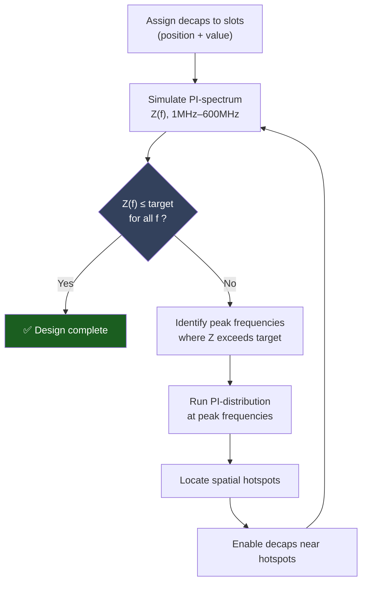
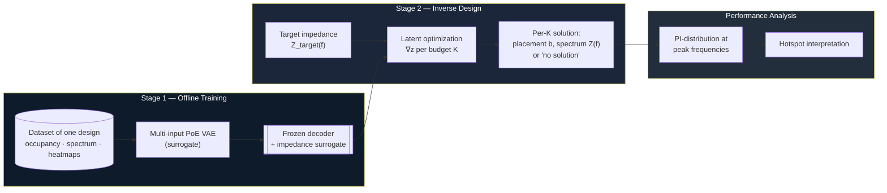
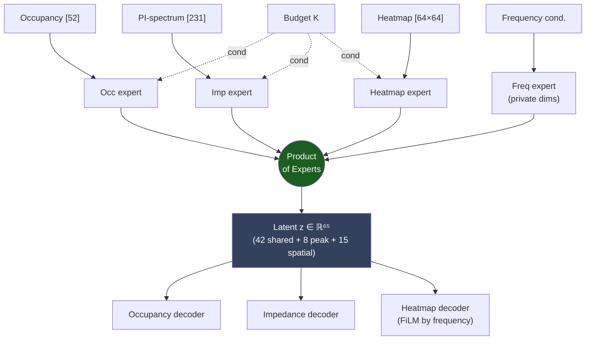
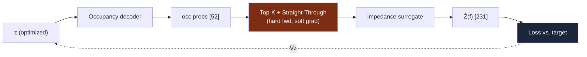
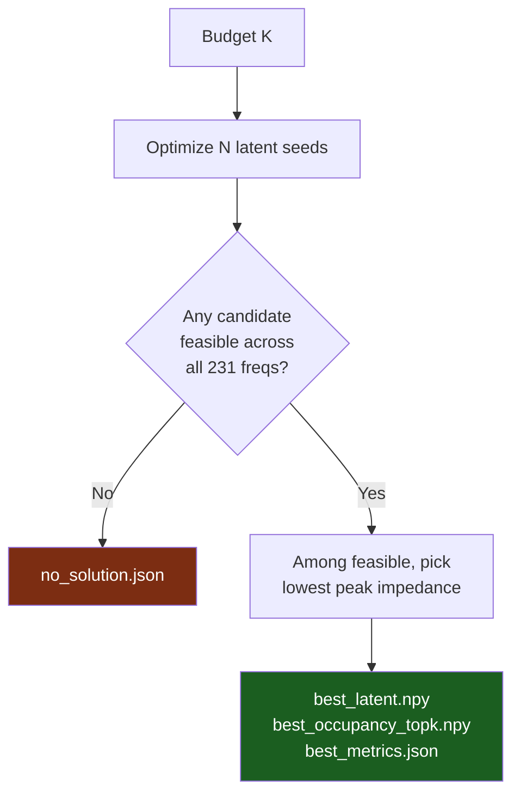

# A Generative AI Framework for the Design Optimization and Performance Analysis of PCB Power Delivery Networks

## A surrogate-driven inverse-design approach to decoupling-capacitor placement

---

## Abstract

The design of a Printed Circuit Board (PCB) **Power Delivery Network (PDN)** requires placing
**decoupling capacitors (decaps)** so that the power-rail impedance seen by an integrated circuit
stays below a frequency-dependent target across the operating band. With dozens of candidate slots,
the configuration space is combinatorial — for a board with 52 slots there are $2^{52}\approx
4.5\times10^{15}$ possibilities — and there is no closed-form mapping from a placement to its
impedance response. In practice, engineers converge on a solution through a slow, manual
loop of *place → simulate → inspect spectrum → locate spatial hotspots → adjust*.

This project develops a **generative-AI framework** that learns this design space from data and
reformulates the search as a continuous inverse-design problem. A multi-input, **product-of-experts
Variational Autoencoder (VAE)** with **graph encoders** and a **structured latent space** is trained
as a differentiable **surrogate** of a single board, jointly modelling (i) the decap occupancy vector,
(ii) the PI-spectrum (impedance magnitude vs. frequency), and (iii) the spatial **PI-distribution**
hotspot maps at a set of frequency anchors, conditioned on the decap budget $K$ and the inspection
frequency. The current model is **`exp057_structured_graph`** (~10.7M parameters, 65-d latent).
With the decoder frozen, **gradient-based latent optimization** then searches the learned latent space
for configurations whose predicted spectrum meets a target, returning — for each decap budget $K$ —
the feasible placement with the lowest peak impedance, or reporting that no feasible solution exists.
An **active-learning loop** can fine-tune the surrogate on newly simulated high-uncertainty layouts.
The result is a **decision-support tool** that proposes physically meaningful starting points for the
engineer's iterative process, collapsing an intractable combinatorial search into a handful of
gradient descents.

---

## Table of Contents

1. [Motivation & Problem Statement](#1-motivation--problem-statement)
2. [The Conventional Engineering Loop](#2-the-conventional-engineering-loop)
3. [Proposed Framework](#3-proposed-framework)
4. [Stage 1 — Generative Surrogate (VAE)](#4-stage-1--generative-surrogate-vae)
5. [Stage 2 — Latent Optimization](#5-stage-2--latent-optimization)
6. [Performance Analysis Layer](#6-performance-analysis-layer)
7. [Repository Structure](#7-repository-structure)
8. [Dataset](#8-dataset)
9. [Installation & Usage](#9-installation--usage)
10. [Limitations & Future Work](#10-limitations--future-work)
11. [What is Tracked in This Repository](#11-what-is-tracked-in-this-repository)

**Current version:** `exp057_structured_graph` (Jul 2026) — structured 65-d latent, occupancy + spectrum GNNs, active-learning fine-tune.

---

## 1. Motivation & Problem Statement

A PDN must keep the impedance $Z(f)$ seen at the IC below a **target impedance mask** $Z_\text{target}(f)$
over the band of interest (here **1 MHz – 600 MHz**, sampled at 231 points). Decaps lower impedance
locally in frequency and space, but their effect is coupled and non-linear. The designer's lever is a
binary placement vector

$$
\mathbf{b}\in0,1^{52},\qquad \mathbf{b}_0 = K,
$$

where each entry selects whether a slot is populated and $K$ is the **decap budget** (a cost/area
constraint). The goal is to find a placement that is *feasible*,

$$
Z(f;\mathbf{b}) \le Z_\text{target}(f)\quad\forall f,
$$

while keeping $K$ small. Because the forward map $\mathbf{b}\mapsto Z(\cdot)$ is only available
through an expensive field solver and the domain $0,1^{52}$ is astronomically large, exhaustive
or even heuristic search is impractical. **This work replaces the forward solver with a learned,
differentiable surrogate and the discrete search with continuous optimization.**

---

## 2. The Conventional Engineering Loop



Each pass through this loop costs a full electromagnetic simulation, and the number of passes grows
with board complexity. The framework below **amortizes** this loop into a one-shot proposal step.

---

## 3. Proposed Framework

The framework has two stages plus an analysis layer, all built around a single trained surrogate.
The full pipeline is summarized below.



| Stage                  | Input                    | Output                           | Code                                                                 |
| ---------------------- | ------------------------ | -------------------------------- | -------------------------------------------------------------------- |
| 1. Surrogate training  | dataset (one design)     | frozen VAE + impedance surrogate | `[experiments/exp057_structured_graph/](experiments/exp057_structured_graph/)` |
| 2. Latent optimization | target $Z_\text{target}$ | best placement per $K$           | `[pipelines/latent/optimize.py](pipelines/latent/optimize.py)`       |
| 3. Analysis            | a solution               | PI-distribution hotspot maps     | VAE heatmap decoder                                                  |
| 4. Active learning     | surrogate uncertainty    | new sim labels + fine-tuned VAE  | `[pipelines/active_learning/run.py](pipelines/active_learning/run.py)` |

---

## 4. Stage 1 — Generative Surrogate (VAE)

The **current model** is **`exp057_structured_graph`**: a multi-input Variational Autoencoder with a
**structured latent** $\mathbf z\in\mathbb R^{65}$ (42 shared + 8 peak + 15 spatial), **graph neural
network (GNN)** encoders for occupancy (52-slot PCB grid) and impedance (231-bin spectrum chain), and a
**Product-of-Experts (PoE)** posterior. Conditioning signals are the decap budget $K$ and (for the
spatial head) the inspection **frequency**.

Earlier experiments (`exp043` PoE baseline → `exp054` self-contained training → `exp055` binary
occupancy decode → `exp056` occupancy GNN → `exp057` structured latent + spectrum GNN) are kept under
`experiments/` for comparison. See `docs/EXP057_STRUCTURED_GRAPH_VAE.md` for architecture details.

### 4.1 Modalities

| Modality                      | Tensor shape    | Role                                                    |
| ----------------------------- | --------------- | ------------------------------------------------------- |
| Decap **occupancy**           | `[52]`          | binary placement (which slots are populated)            |
| **PI-spectrum** (magnitude)   | `[231]`         | impedance vs. frequency, 1–600 MHz                      |
| **PI-distribution** (heatmap) | `[64 × 64 × 1]` | spatial hotspot map at a frequency anchor (~20 anchors) |

### 4.2 Product-of-Experts encoder

Each modality has its own encoder producing a Gaussian "expert" $\mathcal N(\mu_m,\sigma_m^2)$ over
the latent. A dedicated **frequency expert** writes the heatmap-private latent dimensions from the
frequency-conditioning vector alone. Experts are fused by multiplication (PoE):

$$
\mu_\text{PoE}=\frac{\sum_m \mu_m/\sigma_m^2}{\sum_m 1/\sigma_m^2},
\qquad
\sigma_\text{PoE}^{2}=\frac{1}{\sum_m 1/\sigma_m^2}.
$$

**Modality dropout** during training forces any subset of experts to reconstruct the whole, which is
what makes the *occupancy-only* encoding path usable at inference (we only know the placement, not
the spectrum, when proposing designs).



Architecture: `[vae_poe_freq.py](experiments/exp057_structured_graph/codes/vae_poe_freq.py)`,
`[graph_occ.py](experiments/exp057_structured_graph/codes/graph_occ.py)` (PCB-slot GNN),
`[graph_imp.py](experiments/exp057_structured_graph/codes/graph_imp.py)` (spectrum-chain GNN).
Hyperparameters (`latent_dim=65`, `heatmap_private_dim=15`, `cond_dim=8`, binary occupancy decode,
cross-frequency pairs, FiLM heatmap head) are in
`[config.yaml](experiments/exp057_structured_graph/config.yaml)`.

### 4.3 Impedance surrogate

For Stage 2 we additionally use a small **occupancy → impedance** surrogate network
(`surrogate_impedance.py`), which maps a *hard binary* placement directly to its predicted spectrum.
It is the most accurate forward model for the optimizer because it is trained on, and queried with,
exactly the discrete placements the optimizer reads out.

---

## 5. Stage 2 — Latent Optimization

With every network frozen, we optimize the latent vector $\mathbf z$ so that the **decoded
placement's predicted spectrum** meets the target. The forward chain per step is:



### 5.1 The straight-through estimator (key detail)

Reading out exactly $K$ decaps requires a **hard top-$K$** on the occupancy probabilities — a
discrete operation with no gradient. A naïve implementation severs the computational graph, so the
spectrum loss cannot move $\mathbf z$ and the "optimization" degenerates into random seed sampling.
We restore the gradient with a **straight-through estimator**:

$$
\text{topK}*\text{STE}(\mathbf p) = \underbrace{\text{hardtopK}(\mathbf p)}*{\text{forward value}}

- \underbrace{\mathbf p - \text{sg}(\mathbf p)}_{\text{identity gradient}},
$$

where $\text{sg}(\cdot)$ is stop-gradient. The surrogate therefore always sees an in-distribution
binary vector with exactly $K$ ones, while $\partial \mathcal L/\partial \mathbf z$ flows back through
the continuous occupancy. (See `_ste_topk` in the optimizer.)

### 5.2 Objective

For each budget $K$, multiple latent seeds are optimized in parallel with Adam. The composite loss
balances target satisfaction, spectral shape, manifold adherence, and candidate diversity:

$$
\mathcal L = \underbrace{\lambda_\text{ex}\mathcal L_\text{exceed} - \lambda_\text{gap}\mathcal L_\text{gap}}_{\text{meet the target}}

- \underbrace{\lambda_\text{peak}\mathcal L_\text{peak} + \lambda_\text{track}\mathcal L_\text{track} + \lambda_\text{ar}\mathcal L_\text{anti-res}}_{\text{spectral shape  physics}}
- \underbrace{\lambda_\text{z}\mathcal L_\text{prior} + \lambda_\text{b}\mathcal L_\text{boundary}}_{\text{stay on manifold}}
- \lambda_\text{div}\mathcal L_\text{div}.
$$

- **Exceed / gap** — penalize any frequency above $Z_\text{target}-\text{margin}$; reward headroom below.
- **Peak / track** — align the largest resonance peaks (index + magnitude, dual top-$K$) with the target.
- **Anti-resonance** — a physics prior discouraging spurious series-resonance dips.
- **Prior / boundary** — keep $\mathbf z$ within the aggregate posterior so the surrogate stays trustworthy (guards against adversarial off-manifold solutions).
- **Diversity** — push parallel seeds toward distinct placements.

### 5.3 Selection rule



For each $K$ the optimizer returns the single feasible latent with the **lowest peak impedance**
($\min$ over candidates of $\max_f \hat Z(f)$), or an explicit **no-solution** record when no seed
satisfies the target — exactly the decision an engineer needs when a budget is simply too small.

---

## 6. Performance Analysis Layer

Given a proposed placement, the VAE's **frequency-conditioned heatmap decoder** regenerates the
spatial **PI-distribution** at the spectrum's peak frequencies, reproducing the hotspot view the
engineer would normally obtain from a separate field simulation. This closes the interpretability
loop: the framework not only *proposes* a placement but also *explains* where the remaining risk
concentrates spatially.

> **Validity note.** Both the proposed spectrum and these heatmaps are *surrogate predictions*. A
> proposed design should be re-verified with the ground-truth PI solver before adoption; the
> framework's role is to produce high-quality candidates, not to replace final sign-off.

---

## 7. Repository Structure

Scripts are grouped under **`pipelines/`** and **`libs/`**. Path helpers live in
`[repo_paths.py](repo_paths.py)`; see `[docs/FOLDER_RENAME_AND_PATHS.md](docs/FOLDER_RENAME_AND_PATHS.md)`
for the folder rename and migration notes.

```text
.
├── pipelines/                   Runnable workflows (edit CONFIG, then python …)
│   ├── data/                    Build datasets from raw ECAD exports
│   ├── dataset/                 Manifest transforms, subsample, gmax
│   ├── dataset_sim/             ECAD append queue, combination sim, output moves
│   ├── normalize/               Normalization & stats
│   ├── analysis/                Latent traversal, QA utilities
│   ├── visualize/               Heatmap & impedance plotting
│   ├── latent/                  Stage-2 optimization & reports
│   ├── heatmaps/                PEB frequency & combination tools
│   └── active_learning/         Active-learning entry (run.py, finetune_exp057.py)
├── libs/                        Shared import-only modules
│   ├── data_creation/           heatmap, impedance, occupancy, csv_to_occupancy
│   ├── dataset_meta.py          dataset_meta.json helpers
│   └── peb/                     PEB frequency regex helper
├── experiments/                 Generative surrogate experiments (exp029 … exp057)
│   ├── exp043/                  PoE VAE baseline (frequency expert, FiLM heatmap)
│   ├── exp054_K_30/             Self-contained training loop, K≤30 filter
│   ├── exp055_hard_occ/         Binary top-K occupancy decode
│   ├── exp056_graph_vae/        Occupancy GNN on 52-slot PCB grid
│   └── exp057_structured_graph/ ← current model
│       ├── codes/
│       │   ├── vae_poe_freq.py        PoE VAE with structured latent
│       │   ├── graph_occ.py           occupancy GNN encoder/decoder
│       │   ├── graph_imp.py           spectrum-chain GNN encoder/decoder
│       │   ├── train_vae_simple.py    training entry point
│       │   └── eval_off_anchor.py     off-anchor spatial metrics
│       └── config.yaml                hyperparameters
├── active_learning_pi/          Active-learning library + run configs
│   ├── al/                      pipeline, ingest, normalize, finetune, …
│   └── config/exp057.json       exp057 fine-tune settings
├── scrap/                       Sample generation, comparison, orchestration
│   ├── generation/
│   ├── comparison/
│   └── orchestration/           End-to-end multifreq sweep pipelines
├── datasets/                    Training data (not committed — see §8)
├── data_multi_norm_robust/      Robust-normalized cache (not committed)
├── data/
│   ├── heatmaps/                PEB files, all_combinations.csv, decap maps
│   └── latent_runs/             Latent optimization outputs
├── configs/                     target_impedance.npy, frequency grid, masks
├── tools/                       Path migration, docstring helpers, ECADSTAR utils
├── docs/                        Experiment notes, pipeline guides, figures
├── repo_paths.py                Repo-root path helpers (REPO_ROOT, repo_path)
├── evaluation/                  Novelty / quality evaluation of generated samples
├── src_vae/                     Shared VAE training library
└── viewer/                      Result viewers
```

### Experiment lineage (selected)

| Experiment | Key change |
| ---------- | ---------- |
| `exp043` | PoE multi-input VAE + frequency expert (baseline) |
| `exp054_K_30` | Self-contained training; K≤30 unbounded dataset |
| `exp055_hard_occ` | Hard top-K occupancy before heatmap decode |
| `exp056_graph_vae` | GNN occupancy encoder/decoder on PCB grid |
| `exp057_structured_graph` | Structured 65-d latent + spectrum GNN + occ↔imp coupling |

### Common entry points

| Task                          | Command                                                      |
| ----------------------------- | ------------------------------------------------------------ |
| Build multifreq dataset       | `python pipelines/data/processing_multifreq.py`              |
| Normalize dataset             | `python pipelines/normalize/multifreq.py`                    |
| Train surrogate (exp057)      | `python -m experiments.exp057_structured_graph.codes.train_vae_simple` |
| Latent optimization (Stage 2) | `python pipelines/latent/optimize.py`                        |
| Feasibility sampling          | `python pipelines/latent/find_feasible.py`                   |
| Active-learning cycle         | `python pipelines/active_learning/run.py`                    |
| Multifreq sweep               | `python scrap/orchestration/run_multifreq_sweep_pipeline.py` |
| ECAD append pipeline          | `python pipelines/dataset_sim/run_combinations_sim_pipeline.py` |

All pipeline scripts use a **CONFIG block** at the top of the file — edit constants, then run with `python <path>`. Each script's docstring includes **Agent notes** (What, Usage, Config keys). See `[pipelines/README.md](pipelines/README.md)` and `[docs/CONFIG_ONLY_SCRIPTS.md](docs/CONFIG_ONLY_SCRIPTS.md)`.

---

## 8. Dataset

Training data is **not committed** (size). Expected layout under `datasets/`:

```text
datasets/
├── data_multifreq_train/              raw multifreq export (~472k rows)
├── data_multifreq_train_norm_robust/    robust per-MHz normalization (median/IQR)
├── data_multifreq_train_norm_unbounded/ K≤30 filter, used by exp054–exp057
├── data_multifreq_al_overlay_exp057/   active-learning overlay (built per AL cycle)
└── data_multifreq/                      legacy multifreq layout (if present)
    ├── dataset_meta.json    summary: layouts, sample count, PI MHz anchors
    ├── manifest.csv         one row per (layout, frequency) sample
    ├── layouts/             per-layout decap occupancy vectors
    ├── Imp/                 PI-spectrum magnitudes      [231]
    ├── PI_freq/             frequency-conditioning vectors
    ├── heatmap/             PI-distribution maps         [64×64]
    └── Occ_map/             occupancy maps
```

Each normalized tree includes `dataset_meta.json` and `normalization_stats.json`. The optimization
target is `configs/target_impedance.npy` (shape `[231]`).

Build scripts: `pipelines/data/processing_multifreq.py` → `pipelines/normalize/multifreq.py`.
PEB / combination assets live in `data/heatmaps/`. A local robust-normalized cache may also exist at
`data_multi_norm_robust/` (also not committed).

Example `dataset_meta.json` fields: `unique_layouts`, `manifest_rows`, `size.total_mb`,
`pi_frequencies_mhz` (e.g. `[10, 80, 130, …, 600]`), `samples_per_mhz`.

---

## 9. Installation & Usage

```bash
python -m venv .venv && source .venv/bin/activate
pip install torch numpy pyyaml matplotlib pandas pillow tqdm
```

Tested with **PyTorch 2.7 (CUDA 11.8)**; a GPU is recommended for training.

### Running scripts

Every pipeline and workflow script is **CONFIG-only**: open the file, edit the `# CONFIGURATION` block, then run `python path/to/script.py`. Module docstrings explain **What** each script does, **Usage**, and **Config keys** — see `[docs/CONFIG_ONLY_SCRIPTS.md](docs/CONFIG_ONLY_SCRIPTS.md)`.

### Stage 1 — train the surrogate

```bash
# Current model (exp057)
python -m experiments.exp057_structured_graph.codes.train_vae_simple
# config: experiments/exp057_structured_graph/config.yaml
```

Resume from `experiments/exp057_structured_graph/checkpoints/last_model.pt` (set
`resume_checkpoint` in config). Cannot load exp056 or earlier checkpoints — architecture keys differ.

### Build & normalize a dataset (if starting from raw ECAD)

```bash
python pipelines/data/processing_multifreq.py
python pipelines/normalize/multifreq.py
```

### Stage 2 — inverse design

Edit the **CONFIGURATION** block at the top of `[pipelines/latent/optimize.py](pipelines/latent/optimize.py)`
(set `EXPERIMENT` and checkpoint paths — defaults to `exp038_true_multi` for the impedance surrogate),
then:

```bash
python pipelines/latent/optimize.py
```

Results are written to `data/latent_runs/<experiment>/<run-idx>/K##/` as `best_latent.npy`,
`best_occupancy_topk.npy`, `best_metrics.json`, or `no_solution.json`. A Markdown summary is
auto-generated via `pipelines/latent/generate_run_report.py`.

Selected knobs (constants in the CONFIG block):

| Constant              | Meaning                                  | Default   |
| --------------------- | ---------------------------------------- | --------- |
| `NUM_STEPS`           | Adam steps per K                         | 1200      |
| `LR`                  | learning rate                            | 5e-2      |
| `NUM_CANDIDATE_SEEDS` | parallel latent seeds per K              | 32        |
| `K_LIST`              | decap budgets to solve                   | 1 … 25    |
| `BOUNDARY_MARGIN`     | feasibility safety margin                | 0.1       |
| `SELECT_METRIC`       | ranking metric (`max_ohm` = lowest peak) | `max_ohm` |
| `USE_SURROGATE`       | use impedance surrogate vs. VAE decoder  | True      |

### Stage 2 — export to ECADSTAR & compare

After optimization, export samples and build a batch PEB, run PI simulation, then compare:

```bash
python pipelines/latent/export_peb.py
# … run ECADSTAR batch PI on latent_run.peb …
python pipelines/latent/compare_report.py
```

### Active learning (exp057 fine-tune loop)

Edit CONFIG in `[pipelines/active_learning/run.py](pipelines/active_learning/run.py)` and
`active_learning_pi/config/exp057.json`, then:

```bash
python pipelines/active_learning/run.py
```

The default `COMMAND = "full"` runs seven steps: generate candidates → MC uncertainty scoring →
select worst layouts → ECADSTAR simulation → ingest labels → build overlay dataset → fine-tune exp057
(+50 epochs from `last_model.pt`). See `[docs/AL_OPTION_B_FINETUNE_EXP057.md](docs/AL_OPTION_B_FINETUNE_EXP057.md)`.

---

## 10. Limitations & Future Work

- **Single design.** The surrogate is trained on one board; cross-design generalization (a
design-conditioned surrogate) is the natural next step.
- **Surrogate fidelity.** Feasibility is asserted in surrogate space. Ground-truth re-simulation
before sign-off remains mandatory; the active-learning loop (`pipelines/active_learning/`) partially
closes the loop by fine-tuning on newly simulated high-uncertainty layouts.
- **Stage-2 / Stage-1 alignment.** Latent optimization still defaults to `exp038_true_multi`
checkpoints; wiring it to exp057 requires matching occupancy decode and surrogate paths in
`pipelines/latent/optimize.py`.
- **Discrete read-out.** The STE relaxation makes the search gradient-guided, but the
occupancy and impedance decoders are separate heads; tightening their consistency remains an avenue
for improvement.

---

## 11. What is Tracked in This Repository

To keep the repository lightweight, the following are intentionally **excluded** (see `.gitignore`):

- `datasets/` — training data (`data_multifreq_train`, normalized variants, AL overlays, …)
- `data_multi_norm_robust/` — local robust-normalized cache (~7.5 GB)
- `data/latent_runs/` — optimization run outputs (regenerated by Stage 2)
- `data/heatmaps/` — large PEB exports and combination CSVs
- model checkpoints — `*.pt`, `checkpoints/` (regenerated by training)
- `*.peb` simulation exports and oversized HTML reports (>50 MB comparison reports in experiments)
- `src_gan/`, `temp_visuals/`, `ppt/`, virtual-environment and IDE folders, Python caches

Source code (`pipelines/`, `libs/`, `experiments/`, `src_vae/`, `active_learning_pi/`, `scrap/`),
configuration, documentation (`docs/`), and experiment metrics/reports are tracked.

**Remote:** [github.com/kovarthanmuthusamy/pdn-genai-optimization](https://github.com/kovarthanmuthusamy/pdn-genai-optimization)

---

Research prototype — decision-support for PDN decap placement. Proposed designs require ground-truth simulation before sign-off.
