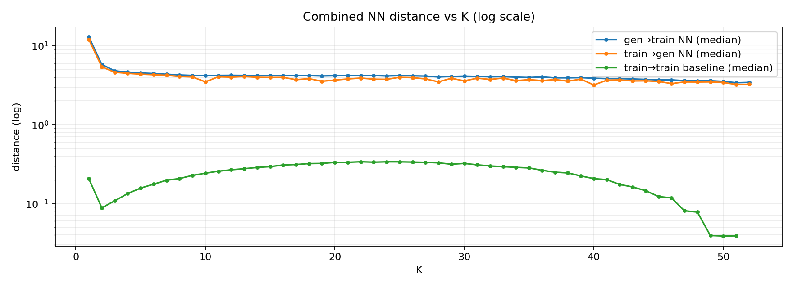
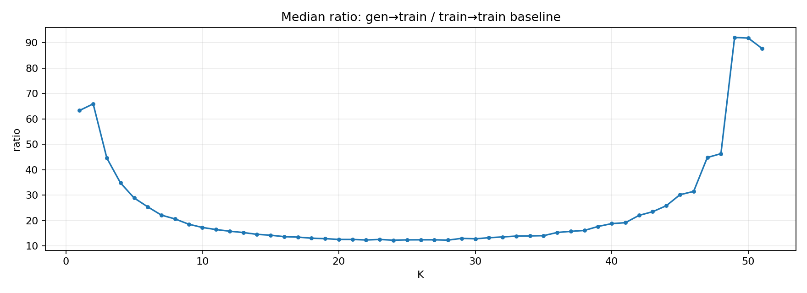
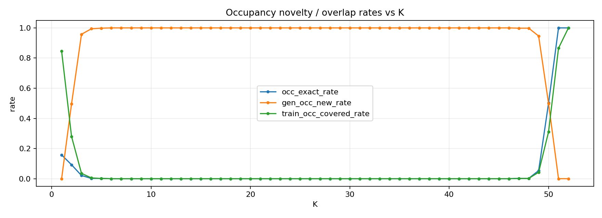
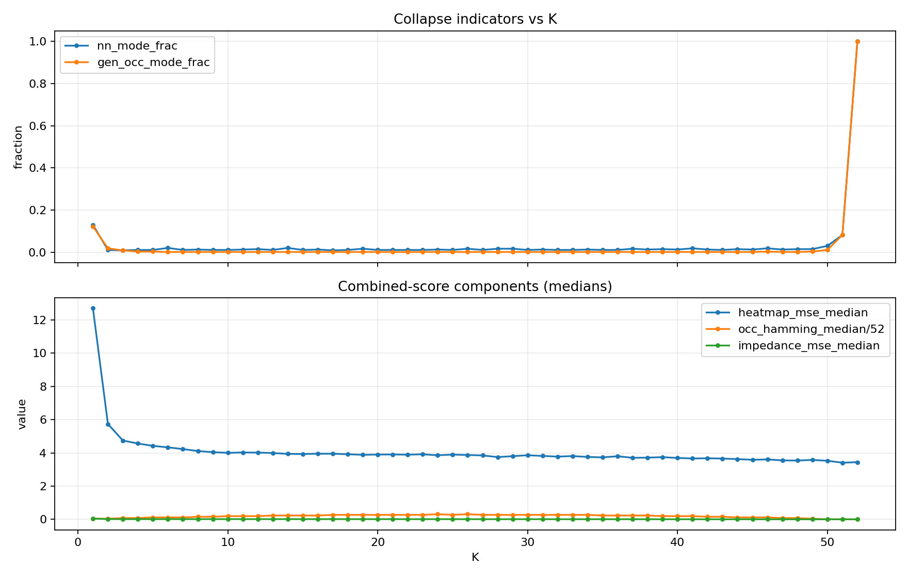

# VAE novelty sweep — summary

Sweep root: `scrap/generated_samples/novelty_sweep_N520`

## At a glance

- Total generated: **27040** samples across **52** K values
- Occupancy exact-match rate: **5.45%**
- Combined_score (median): **4.102**
- gen/base median-distance ratio: **12.27×–92.05×**
- NEW occupancy patterns (rate): **92.09%**
- Training occupancy coverage (union): **1.68%**
- gen→train NN percentile (median): **1**

## Key points

- Mid-range K=6..46 shows **0** occupancy overlap with training (exact-set).
- Occupancy novelty is high overall (see “At a glance”).
- Training occupancy coverage remains low (see “At a glance”).
- gen→train NN percentiles saturate near 1.0 (no direct-copy signal under this metric, but the combined distance scale is strict).
- train→gen coverage@baseline p90 is 0 for all K under the current combined metric (generated samples are not within a typical train→train neighborhood).
- `combined_score` is dominated by heatmap MSE (other terms are much smaller).
- Some extreme K values have very small training support (e.g., K=52), so overlap/collapse metrics there are not representative.

## Plots

(Images are saved under `plots/` relative to the sweep root.)

### Distances vs K

Shows gen→train NN distances vs the train→train NN baseline (log scale).

### Gen/Base ratio vs K

`median_ratio_gen_over_base` = gen_median / baseline_median (higher = further from training in this metric).

### Occupancy novelty/overlap vs K

Exact-set rates computed from occupancy patterns only.

### Collapse indicators + components

Top: mode shares (collapse indicators). Bottom: median components contributing to `combined_score`.

## summary

<!-- BEGIN HUMAN SUMMARY -->
Interpretation :

- Discrete novelty: mid-range K (6–46) shows **zero** exact occupancy overlap with training (exact-set novelty).
- Discrete coverage: only a small fraction of training occupancy patterns are ever hit (see “At a glance”).
- Continuous metric: gen samples are far from training relative to tight train→train spacing (percentiles saturate; coverage@baseline stays at 0). This argues against direct copying under this metric, but also suggests a distance-scale mismatch.
- Plots: distance/ratio curves show generated distances stay much larger than baseline across K; the components plot shows heatmap MSE dominates `combined_score`; collapse indicators are low except at degenerate extreme-K cases.

Net: high discrete novelty, weak training coverage, and the current combined-distance scale likely needs re-scaling/normalization if you want a more sensitive continuous-space novelty/coverage readout.
<!-- END HUMAN SUMMARY -->

## Files

- Per-K summary CSV (all metrics): `scrap/generated_samples/novelty_sweep_N520/novelty_sweep_summary_detailed.csv`
- Sweep aggregate CSV: `scrap/generated_samples/novelty_sweep_N520/novelty_sweep_summary.csv`
- Plots folder: `scrap/generated_samples/novelty_sweep_N520/plots`

## Notes

- This markdown is intentionally compact; use the CSV for full per-K tables and additional metrics.
- `combined_score = heatmap_mse + impedance_mse + (occ_hamming / 52)`.
- Extreme K values can have very small training support, so overlap/collapse metrics there can be misleading.
- If percentile/coverage metrics saturate, consider rescaling distances (e.g., normalize each modality by its train→train baseline scale).
