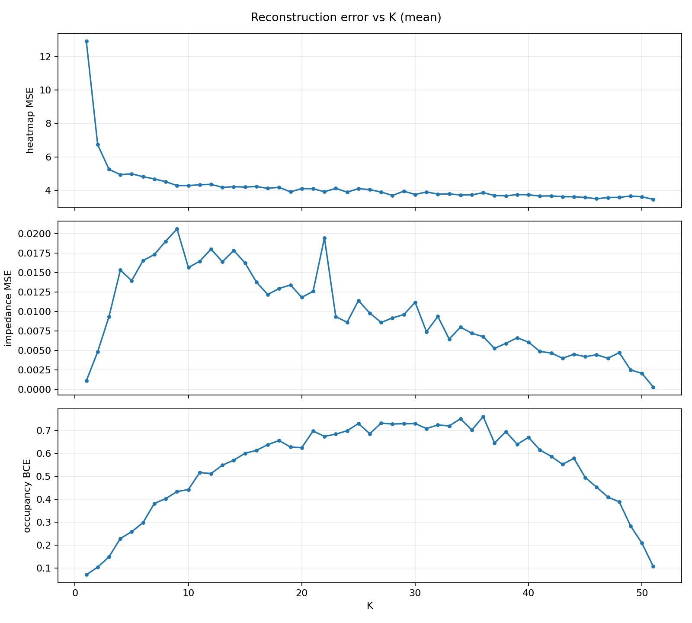
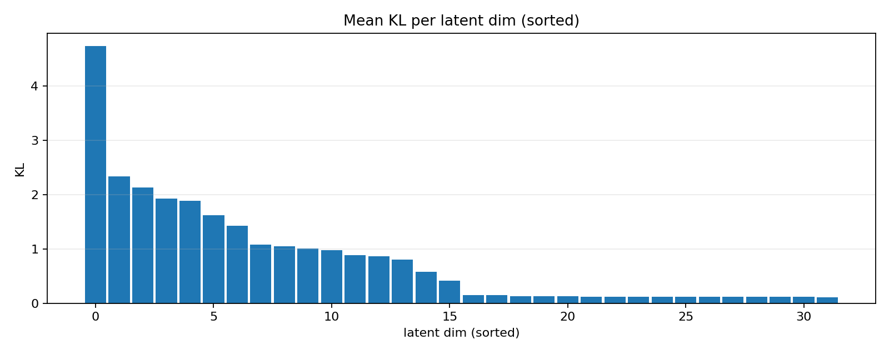
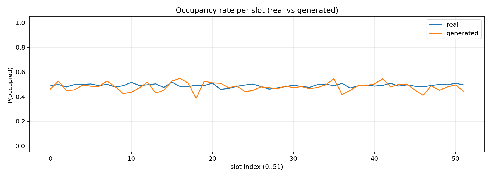

# VAE evaluation report

Checkpoint: `experiments/exp027_sigma_reg_tuning/checkpoints/checkpoint_epoch_400.pt`  
Epoch: `400`  
Device: `cuda`  
Eval samples: `1024`  Generated samples: `1024`

**Summary:** This report is based on 1024 eval and 1024 generated samples, so the global means and per‑K curves are much more stable than a smoke test.

**Interpretation:** Prefer this report for comparing checkpoints/experiments; small changes (e.g., ±0.01 in occupancy BCE) are meaningful here.

## Headline metrics (full multi-modal recon)

- Heatmap MSE (z-score): 4.108
- Heatmap MAE (z-score): 0.8865
- Impedance MSE (norm): 0.01021
- Impedance MAE (norm): 0.03368
- Occupancy BCE (logits): 0.5572
- Occupancy top-K match: 0.6108

**Summary:** Impedance recon is strong (MSE≈0.010 → RMSE≈0.10 in normalized units). Heatmap recon is weaker (MSE≈4.11 → RMSE≈2.03 standard deviations). Occupancy BCE is ≈0.557 (well below the random baseline ≈0.693) with top‑K match ≈0.611.

**Interpretation:** The model learns occupancy signal meaningfully on this eval set, but heatmap recon remains the hardest continuous modality. Also note the strong K‑dependence in occupancy BCE (see recon‑vs‑K plot): mid‑K cases are systematically harder than very low/high K.

## Cross-modal recon (single-modality encoder)

- Heatmap-only → occupancy BCE: 0.6255; impedance MSE: 0.01563
- Impedance-only → occupancy BCE: 0.5332; heatmap MSE: 4.238

**Summary:** Impedance-only encoding produces the best occupancy BCE (0.533), heatmap-only is worse (0.626), and fused sits between them (0.557, above).

**Interpretation:** Impedance is the most informative single modality for occupancy in this model. If the goal is cross-modal generalization, this is a good sign (impedance → occupancy works), but it also suggests fusion is not extracting additional occupancy signal beyond what impedance already provides.

## Latent diagnostics

- Latent dim: `32`
- Mean KL (total): 25.72
- Active units (var(mu) > 1e-02): `16`

**Summary:** Total KL is ≈25.7 nats, and only ~16/32 latent dimensions are “active” by the variance threshold.

**Interpretation:** This is consistent with partial latent under-utilization (many dims near-prior KL). If you want more capacity/diversity, you’d usually try to increase the number of active units (without destabilizing recon) rather than just increasing latent_dim.

## Real vs generated (basic moments, normalized space)

- Occupancy rate mean |real-gen| (52 slots): 0.02877
- Heatmap mean/std (real → gen): -0.3887/1.33 → 0.4381/1.328
- Impedance mean/std (real → gen): 0.004664/0.585 → 0.004944/0.5777

**Summary:** Generated occupancy per-slot marginals match real closely (mean |Δrate|≈0.029). Impedance mean/std also match closely. Heatmaps show a noticeable mean shift (real mean ≈ -0.389 vs gen mean ≈ +0.438) while std is well matched.

**Interpretation:** Generation is well-calibrated for impedance and occupancy marginals, but heatmaps are biased upward in normalized space. If heatmap realism matters, this bias is a primary target (sampling temperature, decoder bias, or loss balancing).

## Plots

**Summary:** These plots explain which regimes drive the aggregate numbers.

**Interpretation (what to look for):**

- **Recon error vs K:** Heatmap MSE drops sharply from very small K then gradually improves with K; occupancy BCE peaks at mid‑K and is much lower at extremes (low/high K). Impedance MSE is worst at low–mid K and steadily improves at higher K.
- **KL per dim:** A few latent dims dominate KL, with many dims near the prior (low KL), matching the 16/32 “active units” count.
- **Occupancy rates:** Real vs generated per-slot marginals track very closely across all 52 slots, consistent with the low mean |Δrate|.

## Files

- Per-sample CSV: `evaluation/vae/vae_eval_per_sample.csv`
- Metrics JSON: `evaluation/vae/vae_eval_metrics.json`

**Summary:** Use the CSV to locate specific failure samples (e.g., filter by K or worst recon). Use the JSON for experiment tracking and plotting trends across runs.

**Interpretation:** When comparing runs, check (1) occupancy BCE/top‑K, (2) the *shape* of occupancy BCE vs K, and (3) the real-vs-gen occupancy marginal gap — these tend to move together when the model genuinely improves.
