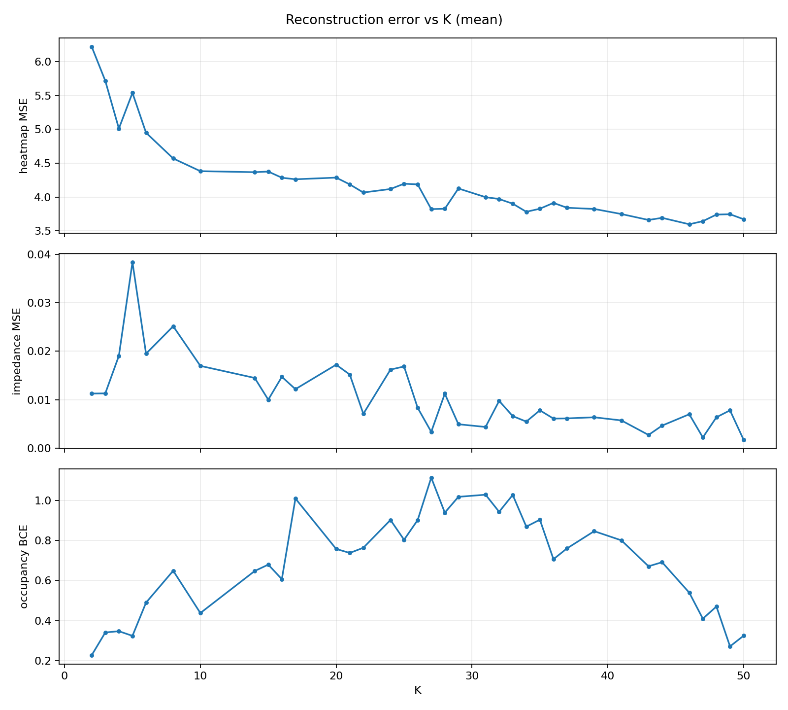
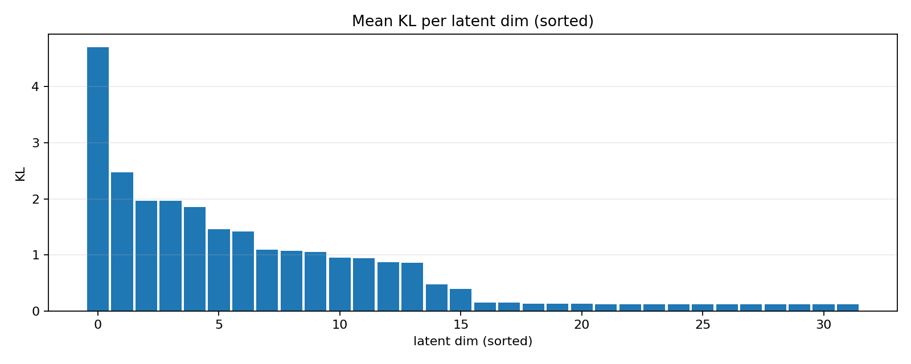
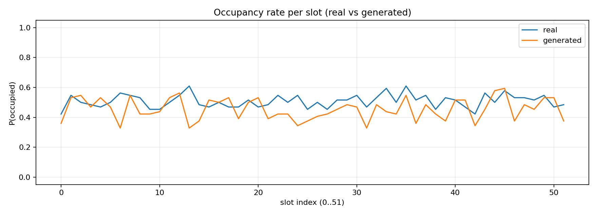
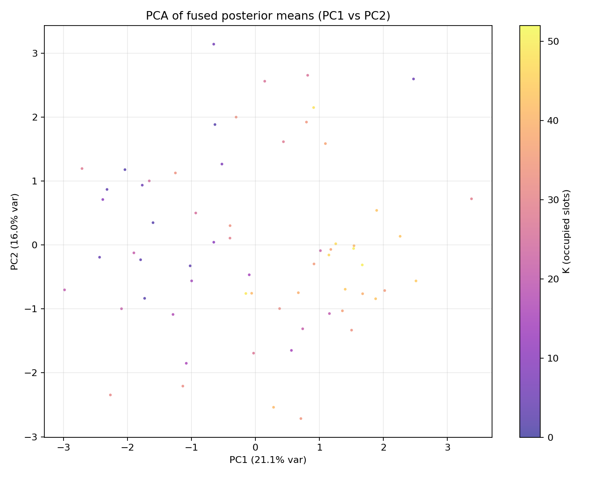
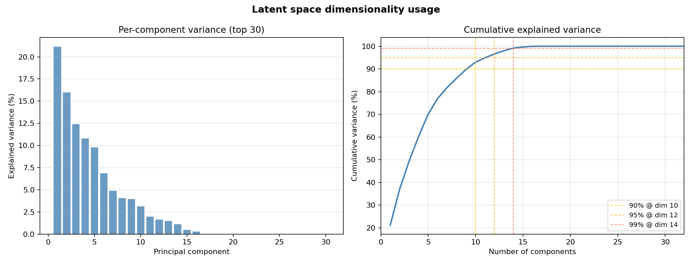
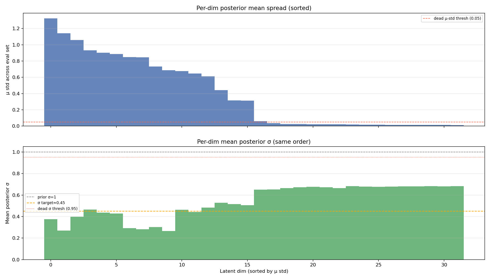
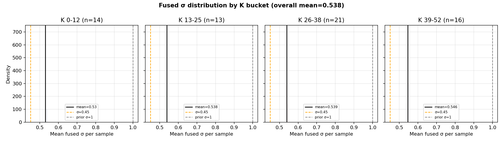
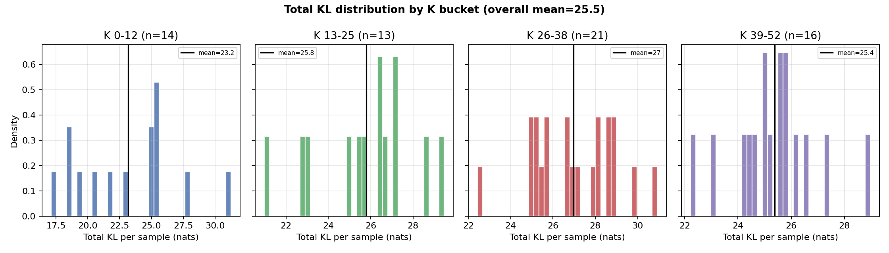
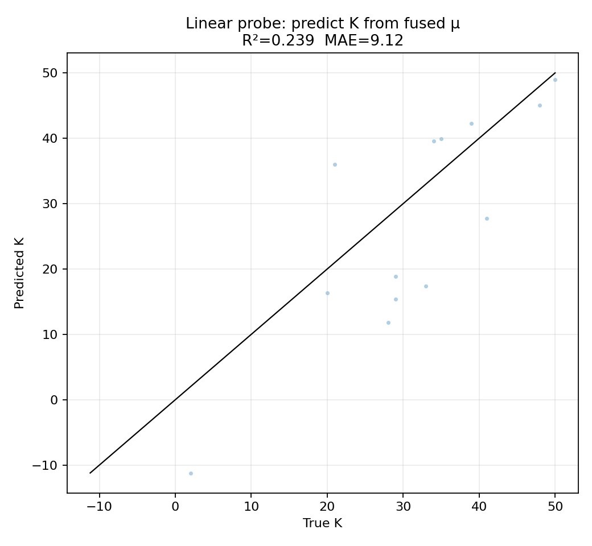
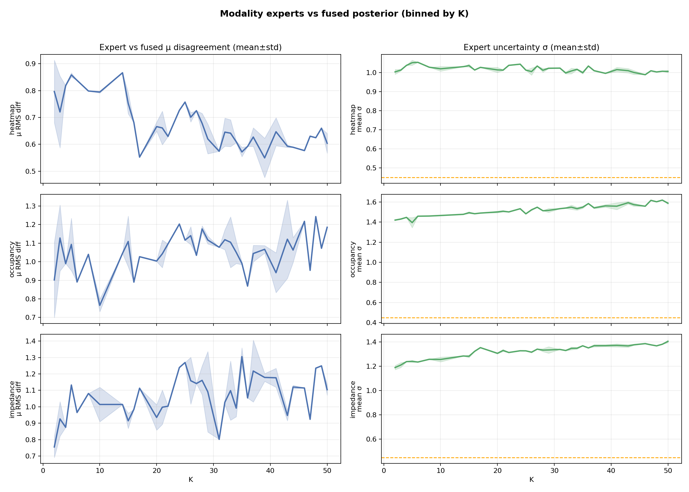

# VAE evaluation report

Checkpoint: `experiments/exp027_sigma_reg_tuning/checkpoints/checkpoint_epoch_400.pt`  
Epoch: `400`  
Device: `cuda`  
Eval samples: `64`  Generated samples: `64`

**Summary:** This is a small smoke run (64 eval / 64 gen), so treat per-K curves and any fine-grained conclusions as noisy.

**Interpretation:** Use this report mainly to validate the evaluation pipeline and to spot large effect sizes (e.g., obvious modality gaps, strong latent collapse, major distribution shifts).

## Headline metrics (full multi-modal recon)

- Heatmap MSE (z-score): 4.271
- Heatmap MAE (z-score): 0.9426
- Impedance MSE (norm): 0.01026
- Impedance MAE (norm): 0.03468
- Occupancy BCE (logits): 0.6909
- Occupancy top-K match: 0.5371
- Occupancy exact match: 0

**Summary:** Impedance recon is relatively strong (MSE≈0.010 → RMSE≈0.10 in normalized units), heatmap recon is weaker (MSE≈4.27 → RMSE≈2.07 standard deviations), and occupancy BCE is ≈0.691 (very close to the random-guess baseline ≈0.693), with top‑K match ≈0.54.

**Interpretation:** The model is learning the continuous impedance signal better than the heatmap, and occupancy is the main bottleneck on this run. “Exact match” is an extremely strict metric for a 52‑bit vector (and with only 64 samples it is common to see 0), so focus more on top‑K match and the BCE-vs‑K curve.

## Cross-modal recon (single-modality encoder)

- Heatmap-only → occupancy BCE: 0.7803; impedance MSE: 0.01424
- Impedance-only → occupancy BCE: 0.5708; heatmap MSE: 4.359

**Summary:** Using only impedance to encode gives notably better occupancy BCE (0.571) than using only heatmap (0.780). Fused recon occupancy BCE (0.691, above) is worse than impedance-only on this run.

**Interpretation:** Impedance appears to carry stronger information about occupancy than heatmap. If this pattern persists on larger eval sets, it suggests the fusion/weighting is not leveraging impedance as effectively as it could (or the occupancy head is under-trained), since the unimodal impedance encoder alone outperforms the fused path for occupancy.

## Latent diagnostics

- Latent dim: `32`
- Mean KL (total): 25.5
- Active units (var(mu) > 1e-02): `16`

**Summary:** The model uses about half the latent dimensions (16/32 active units). The per-dim KL plot shows a small subset of dimensions carrying most of the information.

**Interpretation:** This looks like partial posterior collapse / under-utilization of the full latent capacity. It’s not catastrophic, but it can limit diversity and make the model rely heavily on a few dominant latent factors.

## Latent analysis (held-out encodings)

- PCA dims for 90/95/99% variance: `10` / `12` / `14`
- Dead dims (σ>0.95 & μ-std<0.05): `0 / 32`
- Linear probe K←μ (80/20 split): R² 0.239; MAE 9.118

**Summary:** The fused posterior means lie on a low-dimensional manifold (≈10 dims for 90% variance, ≈14 for 99%). The simple “dead dim” heuristic reports 0/32 dead dims, but the μ-spread plot shows a sharp drop after ~16 dimensions (many dimensions have μ-std near 0). The linear probe indicates K is only weakly predictable from μ (R²≈0.24, MAE≈9.1).

**Interpretation:** Latent structure is dominated by a handful of global factors; K correlates with the leading PCA direction (visible in the PCA scatter), but the relationship is not cleanly linear and likely entangled with other attributes (pattern/layout). Fused σ stays well below the prior (≈0.53–0.55 vs σ=1), while unimodal expert σ is much higher (see expert-vs-fused plot), meaning fusion sharply reduces uncertainty (PoE-style). That can be good for recon, but watch for overconfidence on truly novel/held‑out inputs.

## Real vs generated (basic moments, normalized space)

- Occupancy rate mean |real-gen| (52 slots): 0.07452
- Heatmap mean/std (real → gen): -0.3029/1.504 → 0.6508/1.51
- Impedance mean/std (real → gen): 0.00885/0.5856 → 0.01519/0.5784

**Summary:** Generated impedance moments are close to real. Occupancy per-slot marginals differ by ~0.075 on average, and heatmaps show a noticeable mean shift (real mean ≈ -0.30 vs gen mean ≈ +0.65) while std is similar.

**Interpretation:** The generator is matching impedance distribution reasonably well, but heatmaps appear biased “hotter” in normalized space, and occupancy marginals are only loosely matched on this small sample. If this repeats at larger N, it points to a calibration / sampling-temperature / decoder-bias issue for heatmaps and a marginal distribution mismatch for occupancy.

## Plots

**Summary:** These plots explain *where* the averages come from (especially how performance varies with K).

**Interpretation (what to look for):**

- **Recon error vs K:** Heatmap and impedance recon improve as K increases, while occupancy BCE is worst in mid‑K and much better at the extremes (low/high K).
- **KL per dim:** A few dimensions dominate KL; many dimensions sit near the prior (low KL).
- **Occupancy rates:** Generated per-slot occupancy rates broadly track real, but with noticeable per-slot deviations (and higher jaggedness on small N).
- **Latent PCA scatter/variance:** K aligns with the leading PCA direction; ~10–14 components capture almost all μ variance.
- **Per-dim μ/σ:** Roughly half the dims show substantial μ variation; many dims have near-constant μ with higher σ.
- **σ/KL by K bucket:** Fused σ is fairly stable across K; total KL tends to be higher for mid‑K than very low K.
- **Probe + experts-vs-fused:** K is only weakly linearly decodable; unimodal experts are much more uncertain than the fused posterior and disagree with it in K-dependent ways.

## Files

- Per-sample CSV: `evaluation/vae_smoke/vae_eval_per_sample.csv`
- Metrics JSON: `evaluation/vae_smoke/vae_eval_metrics.json`

**Summary:** The CSV is best for per-sample debugging (e.g., sort by worst occupancy BCE or worst heatmap MSE). The JSON is best for programmatic comparisons across checkpoints/experiments.

**Interpretation:** If you rerun this on held‑out/novel sets, diff the JSON’s `latent_analysis` block and the K-conditioned plots first — they usually reveal generalization gaps earlier than the global means.
