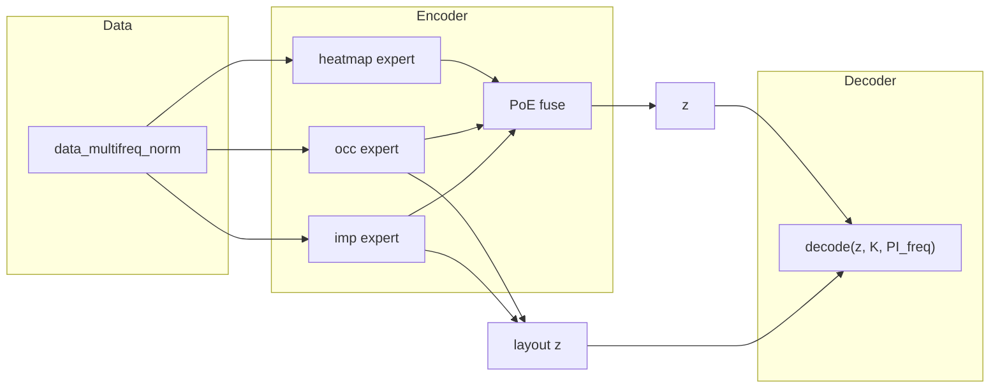

# exp039_improved_heatmap — Detailed Evaluation & Latent Inspection Report

This document is the **full technical reference** for experiment `exp039_improved_heatmap`: what was measured, how it was measured, what the numbers mean, how that connects to multifreq PI heatmap generation, and what changed for **phase-2 training** (resume epoch **500** → **650**).

---

## Table of contents

1. [Experiment context](#1-experiment-context)
2. [Model and data (what is being evaluated)](#2-model-and-data-what-is-being-evaluated)
3. [Evaluation pipeline overview](#3-evaluation-pipeline-overview)
4. [Generative evaluation — detailed (`eval_results/`)](#4-generative-evaluation--detailed-eval_results)
5. [Latent inspection — detailed (`latent_visuals/`)](#5-latent-inspection--detailed-latent_visuals)
6. [Connecting eval + latent to sweep behaviour](#6-connecting-eval--latent-to-sweep-behaviour)
7. [Training metrics at epoch ~500](#7-training-metrics-at-epoch-500)
8. [Phase-2 updates (epochs 500 → 650) — full rationale](#8-phase-2-updates-epochs-500--650--full-rationale)
9. [How to re-run and update this report](#9-how-to-re-run-and-update-this-report)
10. [File index](#10-file-index)

---

## 1. Experiment context

### 1.1 Goal

Train a **multi-input VAE** that models PI distribution **heatmaps** across **PI frequency (MHz)** for a fixed PCB **layout** (occupancy + impedance). The same decap layout can appear at many simulation frequencies; each frequency has its own spatial heatmap, but shared occupancy and impedance.

Downstream use (multifreq sweep / PEB / ECAD comparison):

1. Start from a **layout** (occupancy + impedance), not necessarily a stored heatmap.
2. Build a latent code from layout (+ K).
3. **Decode a heatmap at a chosen MHz** using explicit **PI_freq** conditioning.

So success is not only “low val loss” but:

- Correct **frequency-dependent** heatmaps at anchor and **between-anchor** MHz.
- **Diverse** samples at fixed (K, MHz) for optimisation.
- **Layout inference path** quality (not only full encode with heatmap present).

### 1.2 What exp039 changed vs earlier single-frequency VAEs

| Aspect | Old (e.g. exp025/exp030) | exp039 |
|--------|---------------------------|--------|
| Dataset | `datasets/data_norm` | `datasets/data_multifreq_norm` |
| Heatmap conditioning | K only | **K + PI_freq** (log10-normalised 1–600 MHz) |
| Rows per layout | One heatmap | One heatmap **per anchor MHz** |
| Training extras | — | Cross-freq loss, layout train prob, freq jitter, physical p99 loss |
| Inference | `decode(z, K)` | `decode(z, K, PI_freq)` or `anchor_blend` |

### 1.3 Anchor frequencies in training

Configured in `configs/multifreq_anchors.yaml` (11 MHz values):

`10, 63, 80, 130, 150, 200, 250, 270, 330, 400, 500`

Each anchor corresponds to simulated heatmaps in the dataset. **Between-anchor** MHz (e.g. 100, 175, 350) are **not** separate training rows unless you add more simulations — the model must **generalise** via `PI_freq` conditioning and (at inference) optional **anchor blending**.

---

## 2. Model and data (what is being evaluated)

### 2.1 MultiInputVAE (summary)

- **Encoder experts:** heatmap, occupancy, impedance → Gaussian parameters; fused by **product of experts (PoE)** → latent `z` (42-D total, 8-D heatmap-private + 34-D shared).
- **Decoder:** heatmap branch uses **full z + K + PI_freq** (Fourier features + FiLM on conv); occ/imp use **shared z + K** only.
- **PI_freq:** scalar in `[0, 1]` = normalised log10(Hz) over 1 MHz–600 MHz (`src_vae/others/pi_freq_utils.py`).

### 2.2 Two inference paths (critical for reading metrics)

| Path | How z is obtained | When used |
|------|-------------------|-----------|
| **Full encode** | `encode(heatmap, occ, imp, K, PI_freq)` — all three modalities | Training val, upper bound, “encode_cross” eval |
| **Layout** | `encode_layout_latent(occ, imp, K, PI_freq)` — occ+imp experts only (heatmap expert → prior) | **85–92% of training decodes**, **multifreq sweep / PEB** (`mode="layout"`) |

Off-anchor error is often larger on **layout** because the heatmap expert never saw the target map when forming z.

### 2.3 Dataset split

- ~**491k** rows, ~**49k** layouts.
- **Train/val split by design** (same occupancy+impedance hash → all MHz stay together in train or val).
- Val size ~**49,106** samples.
- Optional **frequency-balanced** sampling during training (`balance_freq: true`).

### 2.4 Scripts and shared helpers

| Script | Role |
|--------|------|
| `codes/evaluate_vae.py` | Six generative tests + off-anchor CSV |
| `codes/visualize_latent.py` | Encode ~30k samples → plots + probes |
| `codes/exp039_eval_common.py` | Load checkpoint, paths, `encode_dataset()` |
| `codes/train_vae_simple.py` | Launcher → `exp038_true_multi` trainer + `config.yaml` |

**Commands:**

```bash
cd ~/gan
python experiments/exp039_improved_heatmap/codes/evaluate_vae.py
python experiments/exp039_improved_heatmap/codes/visualize_latent.py
python experiments/exp039_improved_heatmap/codes/train_vae_simple.py
```

---

## 3. Evaluation pipeline overview



**Generative eval** asks: given samples or layout, are outputs diverse, novel, smooth in z, sensitive to MHz, and accurate on val?

**Latent eval** asks: does fused μ organise by K and MHz, use all dimensions, and stay regularised (σ, KL)?

---

## 4. Generative evaluation — detailed (`eval_results/`)

Output directory: `experiments/exp039_improved_heatmap/eval_results/`

Default checkpoint: `checkpoints/last_model.pt` or `checkpoint_epoch_500.pt` from config. Metrics below are from a run at **~epoch 500**.

---

### 4.1 Test 1 — Variation within K at multiple PI_freq

**Purpose:** Detect **mode collapse**. If every sample at the same (K, MHz) is identical, latent sampling or layout inference is useless for optimisation.

**Procedure:**

1. Fix `K` ∈ {26, 2} (mid-range common vs rare low K).
2. For each MHz ∈ {63, 200, 400}, call `model.inference(50, device, K=K, PI_freq=mhz, mode="layout", shared_temp=T)`.
3. `mode="layout"`: z from occ+imp (marginal synthetic occ/imp if not provided), decode at given MHz — **same as sweep**.
4. Sweep temperature `T` ∈ {0.6, 0.8, 1.0, 1.2, 1.5} (scales latent noise / stats).
5. Metric: **mean pixel std** across the 50 heatmaps (normalized log space), averaged over spatial dimensions.

**Results (hm_std @ T=1.0):**

| K | Role | 63 MHz | 200 MHz | 400 MHz |
|---|------|--------|---------|---------|
| 26 | Common | **0.045** | 0.127 | 0.144 |
| 2 | Rare | 0.155 | 0.261 | 0.207 |

**How to interpret:**

| hm_std @ T=1.0 | Meaning |
|----------------|---------|
| &lt; 0.001 | **Mode collapse** — decoder ignores sampling noise |
| 0.001 – 0.01 | Low diversity |
| &gt; 0.01 | **Healthy** variation for layout inference |
| &gt; 0.1 | Strong diversity (common at high MHz here) |

**Detailed reading:**

- All values are **above** collapse threshold → no global collapse.
- **K=26 @ 63 MHz** is anomalously **low** (0.045): at this frequency the model often produces **similar** layout samples (matches flat decoder grids in latent section). Not necessarily zero diversity, but **weaker** than 200/400 MHz.
- **K=2** has higher std: rare K → wider posterior / more variable generations.
- Impedance std ~0.09–0.22 shows the imp head also varies.

**Plot:** `test1_variation_vs_temperature.png` — curves should rise with temperature; flat line at 0 across temps would indicate collapse.

---

### 4.2 Test 2 — Nearest-neighbour distance

**Purpose:** Detect **memorisation** (copying training heatmaps instead of generalising).

**Procedure:**

1. Load **500 random training** heatmaps (flattened normalized 64×64).
2. Generate **50** layout samples at K ∈ {26, 2}, **200 MHz**, T=1.0.
3. For each generated map, compute L2 distance to **every** training vector; take **minimum** (NN distance).
4. Repeat for heatmap and impedance (ch0).

**Results:**

| K | Mean NN distance (heatmap, normalized space) |
|---|-----------------------------------------------|
| 26 | **~15.8** |
| 2 | **~17.2** |

**How to interpret:**

- Distance **≈ 0** → likely memorising a training point.
- Distance **≫ 0** (here ~16 on ~64×64 normalized vectors) → generations are **far** from nearest train sample → **novel** points on the learned manifold (appropriate for “fill gaps” in design space).
- Do not compare absolutely across experiments without fixed normalization; **relative** trends matter.

**Plot:** `test2_nn_distance.png` — histograms should be centred away from 0.

---

### 4.3 Test 3 — Latent interpolation

**Purpose:** Check **manifold smoothness** — small moves in μ should change heatmaps smoothly, not jump to garbage.

**Procedure:**

1. Find two validation samples with **K=26**.
2. Encode both at fixed **PI_freq** (63 and 200 MHz runs separately) → μ_A, μ_B.
3. For α ∈ [0, 1] (8 steps), z = (1−α)μ_A + α μ_B, decode with same K and PI_freq.
4. Plot heatmap row + impedance row per α.

**What to look for in plots:**

- **Good:** peaks shift gradually; impedance curves morph smoothly.
- **Bad:** midpoints blank, wrong peak count, or discontinuous jumps.

**Files:**

- `test3_interpolation_63MHz.png`
- `test3_interpolation_200MHz.png`

Interpolation uses **posterior mean μ** (deterministic), not sampled z — stricter smoothness test.

---

### 4.4 Test 4 — Prior / layout sampling sanity

**Purpose:** Verify the decoder **uses** latent code z, not ignoring it (posterior collapse symptom).

**Procedure:**

**A) Pure prior:** z ~ N(0,I), decode at fixed K and MHz.

**B) Layout inference:** `model.inference(N, K, PI_freq=mhz, mode="layout", latent_stats=...)` — uses aggregated training posterior stats when sampling.

**Results (@ 63 MHz):**

| K | std(pixels) pure N(0,1) decode | std layout inference |
|---|-------------------------------|----------------------|
| 26 | ~0.28 | ~0.22 |
| 2 | ~0.27 | ~0.26 |

**How to interpret:**

- If pure-prior std **≈ 0** → decoder collapsed (constant output).
- Here std **≫ 0** → decoder responds to z.
- Layout std slightly lower than prior is normal (layout z is more structured).

**Plot:** `test4_prior_sampling_63MHz.png` — two histograms per K; distributions should overlap partially but not be identical delta peaks at one value.

---

### 4.5 Test 5 — Same-μ cross-frequency decode

**Purpose:** Quantify how strongly **PI_freq at decode** changes the heatmap when **latent code is fixed**.

**Procedure:**

1. One val sample (K≈26): full encode → μ.
2. Decode μ with **π_native** (200 MHz) vs **π_alt** (80 MHz).
3. Optional third panel: `decode_heatmap_blended(μ, K, 80 MHz)`.
4. Report mean |recon_80 − recon_200| in **normalized** heatmap space.

**Result:** mean |Δ| ≈ **0.69** (substantial on typical normalized scales).

**Meaning:**

- MHz is **not** redundant given μ — FiLM / freq conditioner on the decoder works.
- This does **not** mean μ alone is enough at inference; Test 5 fixes μ and **only** changes PI_freq. Production still passes explicit MHz every decode.

**Plot:** `test5_crossfreq_z_200_80MHz.png`

---

### 4.6 Test 6 — Off-anchor foreground MSE (most important for sweep)

**Purpose:** Measure **cross-frequency heatmap error** on validation data at MHz values you care about for generalisation.

**Implemented in:** `eval_cross_freq.run_off_anchor_eval()` (called from `evaluate_vae.py` Test 6).

**Per val minibatch:**

1. Ground truth heatmap `hm` at **native** π_native (true simulation MHz for that row).
2. Mask background: `hm_enc = hm` with background pixels zeroed.
3. **layout z:** `z_layout = encode_layout_latent(occ, imp, K, π_native)`.
4. For each test MHz `f` in `eval_off_anchor_mhz`:
   - **encode_cross:** full forward `model(hm_enc, occ, imp, K, π_f)` — heatmap encoder sees wrong frequency conditioning.
   - **layout_cross:** `decode(z_layout, K, π_f)` — **production-like**: layout latent, decode at f.
5. **FG-MSE:** MSE only on foreground pixels where `target > background + 0.5`, averaged per sample.

**Example results (~epoch 500, eval at 80 & 250 MHz):**

| MHz | encode_cross | layout_cross | Ratio layout/encode |
|-----|--------------|--------------|---------------------|
| 80 | 1.12 – 1.23 | 1.41 – 1.47 | ~1.30× |
| 250 | 1.06 – 1.09 | 1.41 – 1.51 | ~1.30× |

**n ≈ 2880** per cell (30 val batches × batch size, aggregated).

**Detailed interpretation:**

| Metric | What it rewards | Relation to sweep |
|--------|-----------------|-------------------|
| **encode_cross** | Model that “knows” heatmap+layout at wrong MHz | Optimistic; uses GT heatmap in encoder |
| **layout_cross** | Layout-only z, decode at f | **Matches PEB / layout inference** |

Gap **layout > encode** (~30% higher MSE) means: **heatmap expert information missing from z** hurts off-anchor decode. Phase-2 training targets this via higher `layout_train_prob`, layout-only cross-freq z, and stronger cross-freq loss.

**Caveat on MHz choice:**

- If **80 MHz** and **250 MHz** are **training anchors**, val contains many rows whose GT **is** that frequency. Reporting “off-anchor” at 250 MHz still includes **native** rows (easy) mixed with cross-freq rows (hard). Phase-2 config uses **100, 175, 350 MHz** — strictly between anchors — for cleaner generalisation metrics.

**Checkpoint history (layout_cross @ 80 MHz, from `metrics/off_anchor_eval_epoch_*.csv`):**

| Epoch band | Approx. layout_cross @ 80 MHz |
|------------|-------------------------------|
| 50–100 | **1.27 – 1.31** (best) |
| 250–450 | 1.38 – 1.43 |
| 500 | **1.47** |

→ **Latest epoch ≠ best for layout off-anchor.** Select checkpoint by `layout_cross`, not only `last_model.pt`.

**Output:** `off_anchor_eval.csv` and per-epoch `metrics/off_anchor_eval_epoch_*.csv`.

---

### 4.7 Generative evaluation — overall verdict

| Question | Answer |
|----------|--------|
| Can we sample diverse layout heatmaps? | **Yes** (except weak diversity at 63 MHz, K=26) |
| Are samples novel vs train? | **Yes** |
| Does decode use z and PI_freq? | **Yes** |
| Is layout path ready for 80/250 MHz sweep? | **Partially** — usable but **main error source**; use **anchor_blend** between anchors |
| What metric should gate checkpoints? | **`layout_cross`** at between-anchor MHz |

---

## 5. Latent inspection — detailed (`latent_visuals/`)

Output directory: `experiments/exp039_improved_heatmap/latent_visuals/`

**Setup:** Up to **30,000** random dataset indices, batch encode with `model.encode(hm, occ, imp, K, PI_freq)`, collect fused **μ**, **logvar**, per-expert stats. Plots use fused μ unless noted.

---

### 5.1 Linear probes — what is being measured?

A **linear probe** trains ordinary least squares: predict scalar label (K or MHz) from 42-D μ on 80% of points, test on 20%.

| Probe | R² | MAE | Meaning |
|-------|-----|-----|---------|
| **K ← μ** | **0.974** | ~1.8 slots | Occupancy complexity is almost linearly readable from latent — expected (K is explicit decoder input and strongly correlated with occ). |
| **MHz ← μ** | **0.840** | ~44.6 MHz | Frequency is embedded in μ but with **~45 MHz typical error** and wide vertical spread at each anchor. |

**plot9_probe_K_from_mu.png:** Points hug diagonal 0–52 — excellent.

**plot9b_probe_MHz_from_mu.png:**

- Vertical stripes at **10, 63, 80, 130, 200, 250, 270, 330, 400, 500 MHz** (discrete training frequencies).
- Spread within each stripe: same MHz, different layouts → different μ.
- Some extrapolation errors below 0 MHz or above 600 MHz at edges — linear probe limitation, not physical frequencies.

**Important:** High MHz R² does **not** remove need for **PI_freq** at decode (see Test 5). μ carries coarse frequency context; decoder FiLM needs explicit MHz for accurate peaks.

---

### 5.2 t-SNE and PCA — geometry of fused μ

**t-SNE (plot1, plot1b):** Nonlinear 2-D embedding; preserves local neighbourhoods, not global distance.

| Coloring | Observation | Implication |
|----------|-------------|-------------|
| **K** (`plot1_tsne_by_K.png`) | Strong **left (low K) → right (high K)** gradient | Latent space **dominated by decap count / layout complexity** |
| **MHz** (`plot1b_tsne_by_MHz.png`) | **Mixed** colours in bulk; yellow (high MHz) patches on periphery | Frequency is present but **entangled** with layout; not separate clusters per MHz |

**PCA (plot2, plot2b, plot3):**

- **PC1** explains **~30.5%** variance; **PC2** **~13.6%**.
- **MHz coloring (`plot2b`):** smooth **rainbow along PC1** from low→high MHz — global frequency direction exists in linear subspace.
- **Variance (`plot3`):** **12** components → 90% cumulative; **16** → 95% of 42 dims.

**Implication:** Model uses **many** latent dimensions; frequency and K share subspaces; no severe PCA collapse to 2-D.

---

### 5.3 Per-dimension μ, σ, and KL

**plot4_per_dim_mu_sigma.png:**

- **μ std** per dimension (sorted): gradual decay, top dims carry more layout information.
- **Mean posterior σ** per dim: most **0.15–0.35**, below training target **0.45**.

**Sigma regularisation target (`sigma_reg_target: 0.45`):** Training encourages average posterior std ≈ 0.45. Observed **~0.29–0.33** means a **tighter** posterior — stable training, less sampling noise, can reduce pixel diversity slightly.

**plot6_sigma_by_K.png:** Mean fused σ **increases** with K bucket (0.27 → 0.33) — model is more uncertain on complex layouts.

**plot6b_sigma_by_MHz_anchor.png:** σ stable across MHz (~0.29–0.31) for populated buckets; **150 MHz empty** → no samples in that bucket in the 30k draw (check data for 150 MHz rows).

**plot7_kl_per_dim.png:** KL per dim sorted — all dims **> 0.3 nats** → **no posterior collapse** (collapsed dims → KL ≈ 0).

**plot8 / plot8b:** Total KL ~43–44 nats per sample, stable across K and MHz — regularisation consistent.

---

### 5.4 Decoder grid along PC1 × PC2

**Method:**

1. PCA on all μ → top two components.
2. Grid in (PC1, PC2) ±3σ, fixed **K=26**, fixed decode **PI_freq** ∈ {63, 200, 400} MHz.
3. Each cell: decode **z = μ_PCA_center + a1·PC1 + a2·PC2** (not necessarily a real training point).

| MHz | Visual result | Interpretation |
|-----|---------------|----------------|
| **63** | Nearly **flat** dark blue maps | Decoder slice weakly sensitive to z at low MHz — aligns with low Test 1 hm_std |
| **200** | Single weak hotspot, little change across grid | Some structure but **low sensitivity** along PCs |
| **400** | Strong hotspots, patterns **change** across grid | Healthy local manifold at high MHz |

**Caveat:** Grid shows **local** decode behaviour around PCA bulk; flat 63 MHz can still mean “all cells similar” while absolute peaks are wrong vs GT.

---

### 5.5 Latent inspection — overall verdict

| Aspect | Status | Notes |
|--------|--------|-------|
| K encoding | **Excellent** | R² 0.97, clear t-SNE gradient |
| MHz encoding in μ | **Good** | R² 0.84; keep explicit PI_freq |
| Dimension usage | **Healthy** | 12–16 PCs for 90–95% variance |
| Posterior collapse | **None** | KL and σ healthy |
| Posterior width | **Tight** | Below σ target |
| Decoder sensitivity | **MHz-dependent** | Weak @ 63/200, strong @ 400 in grid |

---

## 6. Connecting eval + latent to sweep behaviour

| Observation | Eval symptom | Latent symptom | Sweep impact |
|-------------|--------------|----------------|--------------|
| Layout z misses heatmap cues | layout_cross ≫ encode_cross | MHz in μ but layout path skips heatmap expert | Wrong/peaky maps at new MHz from PEB |
| Weak decode at low MHz | Low hm_std @ 63 MHz | Flat decoder grid @ 63 MHz | Flat ECAD comparisons at low MHz |
| Strong at 400 MHz | High hm_std @ 400 MHz | Rich decoder grid @ 400 MHz | Better high-frequency visuals |
| Tight posterior | OK diversity at T=1 | σ ≈ 0.30 | Less spread unless temperature ↑ |
| 10 training anchors | 80 MHz in data (σ buckets) | Stripes at 80 in MHz probe | 80 MHz supervised — still layout path error |

**Unified conclusion:**

Training built a **structured, multifreq-aware latent space**, but **production inference** (layout z + decode at MHz) is the bottleneck — not lack of anchor data alone. Improvements must **align loss with layout_cross**, not only lower val_recon with full encode.

---

## 7. Training metrics at epoch ~500

From `metrics/loss.csv` (illustrative):

| Metric | Train | Val |
|--------|-------|-----|
| total_loss | ~12.0 | ~5.9 |
| heatmap_loss | ~1.16 | ~1.00 |
| kl_loss | ~0.96 | ~1.00 |

Val plateauing while train still decreases → normal with heavy aug and dropout; **off-anchor layout metric** is the better gate for sweep quality.

---

## 8. Phase-2 updates (epochs 500 → 650) — full rationale

Files changed:

- `experiments/exp039_improved_heatmap/config.yaml`
- `experiments/exp038_true_multi/codes/train_vae_simple.py` (+ mirror under `codes/codes/`)
- `experiments/exp039_improved_heatmap/codes/train_vae_simple.py` (launcher → exp038)

### 8.1 Schedule and learning rate

| Key | Value | Why |
|-----|-------|-----|
| `num_epochs` | **650** | 150-epoch fine-tune phase |
| `resume_checkpoint` | **500** | Continue from best recent weights |
| `reset_lr_on_resume` | **true** | New optimizer LR schedule for fine-tune |
| `learning_rate` | **4e-6** (was 8e-6) | Smaller steps — avoid destroying layout features |
| `lr_min` | **2e-6** | Floor for ReduceLROnPlateau |
| `lr_patience` | **25** | Slower LR drops |

### 8.2 Layout + cross-frequency alignment

| Key | Value | Why |
|-----|-------|-----|
| `layout_train_prob` | **0.92** (was 0.85) | Match inference path more often |
| `cross_freq_layout_z_only` | **true** | Cross-freq loss **always** uses `encode_layout_latent` z — same as `layout_cross` eval (previously ~15% of steps used posterior z) |
| `heatmap_focus_cross_freq_weight` | **1.8** | Stronger gradient on cross-MHz heatmap loss |
| `heatmap_focus_heatmap_weight` | **4.0** | Emphasise heatmap reconstruction in focus phase |
| `heatmap_focus_impedance_weight` | **1.0** | Reduce impedance competition in focus phase |
| `heatmap_focus_dynrange_weight` | **3.5** | Peak amplitude / dynamic range |

**Code behaviour (`cross_freq_layout_z_only`):**

```text
# Before: z from training step (layout OR posterior)
# After:  z_cf = encode_layout_latent(occ, imp, K, pi_native) always
cf_loss = heatmap_loss(decode(z_cf, K, pi_alt), heatmap_gt_at_alt_MHz)
```

### 8.3 Physical and peak losses (flat low-MHz maps)

| Key | Value | Why |
|-----|-------|-----|
| `heatmap_phys_p99_weight` | **1.5** | Match p99.9 physical amplitude in foreground |
| `heatmap_peak_weight` | **3.5** | Local peak structure |
| `heatmap_dynrange_weight` | **2.5** | FG vs BG contrast |

### 8.4 Frequency robustness at decode

| Key | Value | Why |
|-----|-------|-----|
| `freq_jitter_prob` | **0.65** | More batches decode at perturbed MHz |
| `freq_jitter_log10_sigma` | **0.12** | Wider jitter in log10(Hz) |

### 8.5 KL and sampling

| Key | Value | Why |
|-----|-------|-----|
| `beta_phase2_final` | **0.12** (was 0.15) | Slightly less KL pressure late fine-tune |
| `train_samples_per_epoch` | **40000** | More cross-freq pair exposure per epoch |
| `freq_balance_power` | **1.2** | Emphasise rarer anchors if counts differ |

### 8.6 Evaluation during training

| Key | Value | Why |
|-----|-------|-----|
| `eval_off_anchor_mhz` | **[100, 175, 350]** | True between-anchor generalisation |
| `eval_off_anchor_max_batches` | **50** | More stable metric than 30 |

### 8.7 What we deliberately did not change

- `latent_dim`, `heatmap_private_dim`, `freq_fourier_features`, `use_heatmap_film` — architecture frozen.
- `split_by_design`, `balance_k` — prevent leakage and preserve rare K.
- Aggressive `sigma_reg` toward 0.45 — would fight peak sharpening.

### 8.8 Phase-2 success criteria

| Metric | Target |
|--------|--------|
| `layout_cross` @ 100 & 350 MHz | **≥15% reduction** vs epoch-500 baseline |
| `layout_cross / encode_cross` | **< 1.15** |
| Test 1 hm_std @ 63 MHz, K=26 | **Increase** (less flat) |
| Checkpoint pick | Min **layout_cross**, not min val_loss only |

### 8.9 Inference recommendations (unchanged by training doc)

- Sweep: `mode="layout"` or **`anchor_blend`** for MHz not in anchor list.
- **`CALIBRATE_FG_MAX=0`** for scientific/fair comparison vs GT (calibration can hide freq errors).
- Compare checkpoints with `evaluate_vae.py` and `eval_cross_freq.py` after phase 2.

### 8.10 How to start phase 2

```bash
cd ~/gan
python experiments/exp039_improved_heatmap/codes/train_vae_simple.py
```

**Log checklist:**

- `Loaded config overrides from config.yaml`
- `cross_freq_layout_z_only=True`, `layout_train_prob=0.92`
- `Resume: .../checkpoint_epoch_500.pt`
- Every 25 epochs: `off_anchor_eval_epoch_*.csv` with 100/175/350 MHz

---

## 9. How to re-run and update this report

```bash
cd ~/gan

# After training / new checkpoint:
python experiments/exp039_improved_heatmap/codes/evaluate_vae.py \
  --ckpt experiments/exp039_improved_heatmap/checkpoints/last_model.pt \
  --off-anchor 100 175 350

python experiments/exp039_improved_heatmap/codes/visualize_latent.py \
  --ckpt experiments/exp039_improved_heatmap/checkpoints/last_model.pt \
  --grid-mhz 63 80 200 250 400

# Standalone off-anchor (full cross-freq table):
python experiments/exp038_true_multi/codes/eval_cross_freq.py \
  --ckpt experiments/exp039_improved_heatmap/checkpoints/last_model.pt
```

Update the numeric tables in Sections 4–7 from new `eval_results/off_anchor_eval.csv`, `latent_visuals/plot9*.png` titles, and `metrics/off_anchor_eval_epoch_*.csv`.

---

## 10. File index

### `eval_results/`

| File | Content |
|------|---------|
| `test1_variation_vs_temperature.png` | hm_std vs T for K=2,26 and MHz=63,200,400 |
| `test2_nn_distance.png` | NN histograms heatmap + impedance |
| `test3_interpolation_63MHz.png` | μ interpolation, decode @ 63 MHz |
| `test3_interpolation_200MHz.png` | μ interpolation, decode @ 200 MHz |
| `test4_prior_sampling_63MHz.png` | Pixel histograms prior vs layout |
| `test5_crossfreq_z_200_80MHz.png` | Same μ, decode 200 vs 80 vs blend |
| `off_anchor_eval.csv` | encode_cross vs layout_cross FG-MSE |

### `latent_visuals/`

| File | Content |
|------|---------|
| `plot1_tsne_by_K.png` | t-SNE, colour = K |
| `plot1b_tsne_by_MHz.png` | t-SNE, colour = MHz |
| `plot2_pca_scatter_by_K.png` | PCA PC1–2, colour = K |
| `plot2b_pca_scatter_by_MHz.png` | PCA PC1–2, colour = MHz |
| `plot3_pca_variance.png` | Scree + cumulative variance |
| `plot4_per_dim_mu_sigma.png` | Per-dimension μ std and mean σ |
| `plot5_decoder_grid_K26_f{63,200,400}MHz.png` | Decode grid in PCA plane |
| `plot6_sigma_by_K.png` | Fused σ histograms by K bucket |
| `plot6b_sigma_by_MHz_anchor.png` | Fused σ by MHz anchor bucket |
| `plot7_kl_per_dim.png` | Mean KL per latent dimension |
| `plot8_kl_by_K.png` | Total KL by K bucket |
| `plot8b_kl_by_MHz_anchor.png` | Total KL by MHz bucket |
| `plot9_probe_K_from_mu.png` | Linear probe K ← μ |
| `plot9b_probe_MHz_from_mu.png` | Linear probe MHz ← μ |

### `metrics/` (training)

| File | Content |
|------|---------|
| `loss.csv` | Per-epoch train/val losses |
| `off_anchor_eval_epoch_*.csv` | Checkpoint off-anchor metrics |
| `timing.json`, `epoch_timing.csv` | Training performance |

### Related code & config

| Path | Role |
|------|------|
| `config.yaml` | Training + eval MHz overrides |
| `codes/evaluate_vae.py` | Generative test suite |
| `codes/visualize_latent.py` | Latent plots |
| `codes/exp039_eval_common.py` | Shared load/encode helpers |
| `codes/train_vae_simple.py` | Training launcher |
| `../exp038_true_multi/codes/train_vae_simple.py` | Training implementation |
| `../exp038_true_multi/codes/eval_cross_freq.py` | Off-anchor + native/cross table |

---

*Document version: detailed inspection + phase-2 config as applied. Primary metrics from checkpoint ~epoch 500; update after phase-2 completes.*
