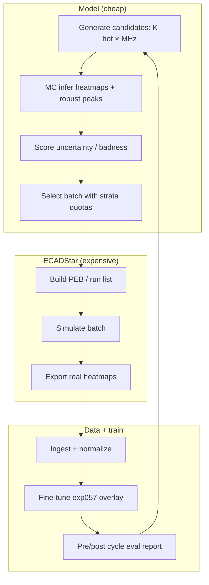

> [!info] Mirror of `docs/active-learning.md` — edit the source file, then re-run `tools/build_vault.py`.

# Active learning for the PDN surrogate

Methodology for improving the exp057 surrogate with selective ECADStar labels, focused on **off-anchor** PI frequencies and uncertain layouts. Implementation: `active_learning_pi/` and `pipelines/active_learning/`.

---

## 1. Motivation

Full multifreq simulation of every candidate placement is expensive. Active learning (AL):

1. Scores many **cheap** model predictions (MC dropout / uncertainty).
2. Simulates only the **worst / most uncertain** batch.
3. Ingests labels, builds an overlay dataset, and **fine-tunes** the surrogate.
4. Evaluates pre- vs post-finetune on the new ECAD layouts and training off-anchor metrics.

**Falsification baseline (recommended for thesis):** compare uncertainty acquisition to **random** acquisition at the same ECAD budget. Without that, AL gains are not causally attributable.

---

## 2. Loop overview



### Recommended acquisition signals

| Signal | Notes |
|--------|-------|
| MC dropout variance of robust peaks (p99 / top-K) | Default practical choice |
| Ensemble disagreement | Stronger uncertainty, higher cost |
| Layout-path instability | Targets deployment decode path |
| Frequency-gap prior | Oversample between training anchors |

Avoid `max()` as a primary score; prefer foreground percentiles (`p95`, `p99`) and top-K means.

---

## 3. Option B — full cycle (exp057)

Entry: edit CONFIG in `pipelines/active_learning/run.py`, then:

```bash
python pipelines/active_learning/run.py
```

Default `COMMAND = "full"` runs eight steps:

| Step | Action |
|------|--------|
| 1–3 | Per-K acquire: candidates → MC infer → select worst |
| 4 | ECADStar simulate selected batch |
| 5 | Ingest + normalize + **pre-finetune** eval |
| 6 | Build cumulative overlay dataset |
| 7 | Fine-tune: resume `last_model.pt` → `+extra_epochs` (typically 50) |
| 8 | Post-finetune eval + `CYCLE_EVAL_REPORT.md` |

Config file: `active_learning_pi/config/exp057.json` (MC default).  
GP opt-in: `active_learning_pi/config/exp057_gp_error.json` (`acquisition_mode: "gp_error"`) — see [[gp-error-surrogate|gp-error-surrogate.md]].

| Key | Typical value | Role |
|-----|---------------|------|
| `candidates_per_k` | 400 | Scored per \(K\) |
| `worst_per_k` | 10 | ECAD sims per \(K\) |
| `k_sweep_per_pool` | true | Separate pool per \(K\) |
| `finetune.extra_epochs` | 50 | Epochs after resume |
| `evaluation.infer_scope` | ingested | Re-score ECAD layouts only |
| `eval_off_anchor_mhz` | 90, 265, 435, 510 | True off-anchor eval points |

### Commands

| `COMMAND` | Effect |
|-----------|--------|
| `full` | All steps |
| `cycle` | Acquire → ingest (no fine-tune) |
| `finetune` | Overlay + train only |
| `evaluate-post-finetune` / `evaluate-report` | Step 8 / regenerate report |
| `PROPOSE_ONLY = True` | Generate + infer only (no ECAD) |

Resume: each fine-tune continues from `last_model.pt` epoch → epoch + `extra_epochs`.

---

## 4. Per-K pools (K = 3…10)

For each \(K \in \{3,\ldots,10\}\):

- Score **400** candidates
- Select **10** for ECAD

| | Per cycle |
|--|-----------|
| Candidates scored | \(8 \times 400 = 3200\) |
| ECAD simulations | \(8 \times 10 = 80\) |

Occupancy varies (random \(K\)-hot); frequency is **stratified** (next section).

**Pros:** Balanced label budget across design-relevant \(K\); avoids flooding one \(K\).  
**Cons:** 80 sims/cycle is still costly; \(K>10\) not covered by this sweep.

---

## 5. Stratified MHz (pool and ECAD)

Per \(K\) pool (400 candidates):

| MHz | Pool count | ECAD worst (of 10) |
|-----|------------|--------------------|
| 90, 265, 435, 510 | 80 each | 2 each |
| 100, 200, 250, 500 | 20 each | 1 each at 100 and 200 only |

Bias toward **off-anchor** frequencies while retaining some on-anchor checks.

### Optional exploration slice

Reserve `explore_candidates_per_k` draws from `explore_mhz_grid` or a continuous range so uncertainty can discover weak bands (e.g. near 270 MHz) without a full labeled grid. Main strata auto-scale to the remaining quota.

**Pros:** Controlled frequency coverage; thesis-friendly reporting of quotas.  
**Cons:** Fixed quotas can miss unexpected weak bands unless exploration is enabled.

---

## 6. Cycle evaluation artifacts

Per iteration under `active_learning_pi/runs/<run>/iter_XXXX/`:

| File | Content |
|------|---------|
| `eval_off_anchor_pre_finetune.json` | After ingest, before FT |
| `eval_off_anchor_post_finetune.json` | After FT |
| `eval_cycle_summary.json` | Pre vs post + training off-anchor |
| `CYCLE_EVAL_REPORT.md` | Human-readable cycle report |
| `k_sweep_summary.json` | Per-K badness / MHz distributions |

Report sections: cycle overview, fine-tune metrics, ECAD p99 MAE pre/post, training `layout_cross` off-anchor table, artifact paths. Symlink/copy: `LATEST_CYCLE_EVAL_REPORT_iterXXXX.md` at run root.

---

## 7. Thesis reporting checklist

1. State acquisition rule (MC variance of which statistic) and MC pass count.
2. Report **ECAD budget** per cycle (80) and cumulative labels.
3. Show pre vs post metrics on **held-out or newly labeled** layouts (not only train loss).
4. Include a **random-acquisition** control if claiming AL superiority.
5. Keep claims within trained \(K\) and frequency coverage.

Package details: [[Docs Index|`../active_learning_pi/README.md`]].


## Implemented by

- [[pipeline]] — `active_learning_pi/al/pipeline.py`
- [[inference_pool]] — `active_learning_pi/al/inference_pool.py`
- [[acquisition]] — `active_learning_pi/al/acquisition.py`
- [[candidates]] — `active_learning_pi/al/candidates.py`
- [[build_overlay]] — `active_learning_pi/al/build_overlay.py`
- [[finetune_run]] — `active_learning_pi/al/finetune_run.py`
- [[run]] — `pipelines/active_learning/run.py`
