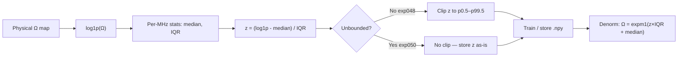
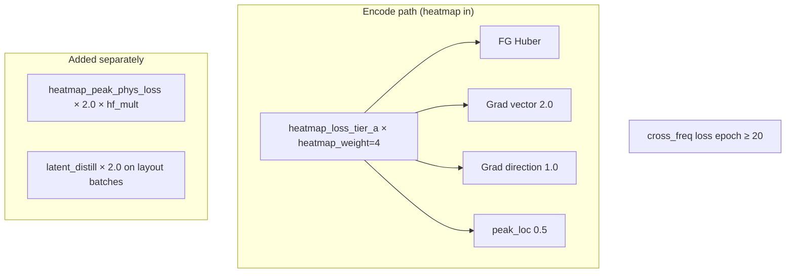

> [!info] Mirror of `docs/normalization-and-losses.md` — edit the source file, then re-run `tools/build_vault.py`.

# Normalization and heatmap loss strategies

Technical reference for the multifreq PI heatmap surrogate: **why** each design choice was made, **what** it does mathematically, **limitations**, comparisons, and a short **literature review**.

Originally developed and documented around **exp050**; the same normalization family and Tier-A loss principles carry into **exp054–exp057**. Later additions (hard occupancy decode, top-region Huber) are summarized in [[model-architecture|model-architecture.md]].

**Related code (current lineage)**

| Topic | Location |
|-------|----------|
| Normalize pipeline | `pipelines/normalize/multifreq.py` |
| Unbounded K≤30 build | `pipelines/normalize/build_train_norm_unbounded.py` |
| Central denorm / stats | `src_vae/others/norm_stats.py` |
| Heatmap peak / Tier-A losses | `experiments/exp057_structured_graph/codes/heatmap_peak_losses.py` (and exp054–056 vendors) |
| Training dataset | `datasets/data_multifreq_train_norm_unbounded` |

---

## Part 1 — Heatmap normalization

### 1.1 Problem statement

PI (power integrity) heatmaps are **physical impedance maps** in ohms (Ω), stored as 64×64 (×1 channel) grids per layout × frequency. They are:

- **Non-negative and right-skewed** — most foreground pixels are modest; a few hotspots can be very large.
- **Frequency-dependent** — typical foreground Ω rises from low MHz (e.g. 10) to high MHz (e.g. 400).
- **Outlier-prone** — rare layouts produce extreme peaks (60–80+ Ω) that distort global statistics.

The model trains in **normalized z-space**; inference and QC convert back to Ω via `normalization_stats.json`.

---

### 1.2 Naming: what we call “current” normalization

| Name in code | Human-readable name |
|--------------|---------------------|
| `robust_log1p_per_mhz` | Per-MHz robust log1p z-score (median/IQR), **clipped** |
| `robust_log1p_per_mhz_unbounded` | Same, **no foreground clip** (exp050) |
| `log_zscore` | Legacy global log mean/std z-score |

**Recommended short label:** *Per-MHz robust log1p z-score (median/IQR)*.

This is a **robust z-score** (not classical mean/std z-score): center = median, scale = IQR, domain = log(1+Ω), stratified by anchor MHz.

---

### 1.3 Pipeline overview



**Build command (unbounded):**

```bash
NORM_ROBUST_PER_MHZ=1 NORM_UNBOUNDED_Z=1 .venv/bin/python pipelines/normalize/multifreq.py
```

---

### 1.4 Step-by-step: current method (exp050)

**Step 1 — Log1p transform**

For each foreground pixel with physical value Ω:

```
x = log(1 + Ω)
```

- Handles zeros; compresses heavy tails (standard for skewed positive data).
- Same spirit as `log1p` in single-cell RNA-seq pipelines (Scanpy/Seurat) and geophysical attribute normalization (Ha et al., 2021).

**Step 2 — Per anchor MHz bins**

Stats are computed **separately** for each training anchor (10, 70, 120, 200, 270, 400 MHz). Each heatmap file is assigned to the nearest anchor.

**Step 3 — Robust center and scale**

On all foreground log1p values in that MHz bin:

- **Median** — middle of the bulk; resistant to extreme peaks.
- **IQR** = Q3 − Q1 (75th − 25th percentile); spread of the middle 50%.

```
z = (log1p(Ω) - median_mhz) / IQR_mhz
```

**Step 4 — Unbounded vs clipped**

| Mode | Foreground z | `clip_min` / `clip_max` in JSON |
|------|--------------|----------------------------------|
| Clipped (exp048) | Hard clip to per-MHz p0.5–p99.5 | Used at load/train/denorm |
| Unbounded (exp050) | No clip | **QC metadata only** (reference) |

**Step 5 — Denormalization**

```
log1p(Ω) = z × IQR_mhz + median_mhz
Ω = expm1(log1p(Ω))
```

Implemented in `HeatmapNormStats.norm_to_physical()` with per-batch `pi_freq` for MHz routing.

---

### 1.5 Comparison: normalization strategies in this repo

| Aspect | Legacy `log_zscore` | Robust clipped (`exp048`) | Robust unbounded (`exp050`) |
|--------|---------------------|---------------------------|------------------------------|
| Transform | log(1+Ω) | log(1+Ω) | log(1+Ω) |
| Center | Global **mean** | Per-MHz **median** | Per-MHz **median** |
| Scale | Global **std** | Per-MHz **IQR** | Per-MHz **IQR** |
| Outliers | Inflate mean/std | Mostly isolated from scale | Same + rare z preserved |
| Peak geometry in z | Flattened by clip | Flattened by p99.5 clip | **Preserved** |
| 400 MHz risk | Mixed scale | Ceiling ~19.7 Ω in gen | Magnitude runaway if loss weak |
| Best for | Baseline / legacy ckpts | Stable bounded training | Spatial + true peak learning |

**Median vs mean / IQR vs std (intuition)**

- **Std + mean:** one 80 Ω layout widens the ruler for everyone → most pixels look “small”; peaks crushed.
- **IQR + median:** ruler set by the middle 50% → peaks stay as high-z outliers; rare tails remain learnable.

This matches scikit-learn’s `RobustScaler` design rationale: *“outliers can often influence the mean and standard deviation in a negative way… using the median and the interquartile range often give better results”* (sklearn RobustScaler (`https://scikit-learn.org/stable/modules/generated/sklearn.preprocessing.RobustScaler.html`)).

---

### 1.6 Why we use this normalization (design rationale)

1. **Skewed PDN-like fields** — impedance maps are not Gaussian; robust scaling is standard for skew + outliers (Brownlee, 2020; MLMastery robust scaler guide).
2. **Per-MHz stratification** — PI magnitude rises with frequency; a single global scale blurs “what is high at 400 MHz”.
3. **Log1p** — stabilizes variance on positive heavy-tailed data before linear scaling (Ha et al., 2021; common in geoscience/ML preprocessing).
4. **Unbounded (exp050)** — hard clip at p99.5 **flattens hotspot gradients**, hurting grad/peak losses; unbounded keeps true peak ordering in z (see exp048 vs exp049 sweep: clipped → spatial ceiling; unbounded → better shape, Ω blow-up without phys loss).

---

### 1.7 Limitations

| Limitation | Detail |
|------------|--------|
| **Robust ≠ immune to outliers** | Extreme pixels still exist in z; they are not removed, only don’t define the scale (Stack Overflow / sklearn docs (`https://stackoverflow.com/questions/51841506/data-standardization-vs-normalization-vs-robust-scaler`)). |
| **IQR ignores tail structure** | Middle 50% sets the ruler; very hot tails rely on unbounded z + phys loss for calibration. |
| **Anchor assignment** | Off-anchor MHz uses nearest anchor stats — interpolation error for far-off frequencies. |
| **Log1p domain** | Defined for Ω ≥ 0; negative values (if any bug) are invalid. |
| **Unbounded training** | Model can extrapolate high z at high MHz without Ω-level brake → need phys blob + overshoot penalty. |
| **Stats leakage** | Stats must be fit on **training set only** (standard ML practice for any scaler). |
| **Percentiles in JSON** | `clip_min`/`clip_max` in unbounded mode are **QC references**, not training bounds — do not use as loss targets. |

---

### 1.8 Literature review — normalization

| Reference | Relevance |
|-----------|-----------|
| **Huber (1964); sklearn `RobustScaler`** | Median/IQR scaling robust to outliers vs mean/std. |
| **Brownlee (2020), *Machine Learning Mastery*** | Practical guide: RobustScaler for skewed data with outliers. |
| **Ha et al. (2021), *Geophysics*** — log transform & per-class normalization PDF (`https://mcee.ou.edu/aaspi/publications/2021/Ha_et_al_2021-An_in-depth_analysis_of_logarithmic_data_transformation_and_per_class_normalization_in_machine_learning.pdf`) | Log transform reshapes skewed attributes; per-class/per-group normalization outperforms single global z-score for heterogeneous regimes. |
| **Box & Cox (1964); Yeo-Johnson (2000)** | Power transforms toward normality — alternative to fixed log1p; more flexible but heavier to fit per MHz. |
| **Tukey (1957); Bartlett (1947)** | Classical variance-stabilizing transforms motivating log-type maps. |
| **Stack Overflow / sklearn robust scaling examples** | Clarifies: robust scaling does not remove outliers from data, only reduces their influence on scale. |

**Gap in literature:** Few papers target **2D spatial impedance heatmaps** for PCB PI with per-frequency robust log scaling. Closest analogs: geophysical attribute maps (Ha et al.) and generic `RobustScaler` for tabular/image regression on skewed targets.

---

## Part 2 — Heatmap loss strategy (exp050 Tier A)

### 2.1 Design principles (2025–2026 arc)

Evolution across experiments:

| exp | Normalization | Loss philosophy |
|-----|---------------|-----------------|
| exp048 | Robust clipped | p99 phys + percentile dynrange |
| exp049 | Unbounded | p99 phys + p95 dynrange — magnitude runaway @ 400 MHz |
| **exp050 Tier A** | Unbounded | **No percentile training**; pixel + grad + localized Ω blob |

**Core rules**

1. **Percentiles for QC only** — not in training loss (p99/p95 targets flatten or inflate bulk).
2. **Anchor FG with huber** — full hotspot level; grad alone misses absolute scale.
3. **Grad for flow geometry** — Sobel vector field on FG; background loss = 0.
4. **Phys Ω on top-k blob only** — magnitude + overshoot where target is hot, not global.
5. **Pearson for eval only** — global correlation; removed from training.

---

### 2.2 Active loss stack



| Loss | Config weight | Scope | Role |
|------|---------------|-------|------|
| FG Huber | inside `heatmap_weight: 4.0` | All FG pixels | Pixel-level Ω in z-space |
| Grad vector | `heatmap_grad_vector_weight: 2.0` | FG only | Match Sobel ∂x, ∂y |
| Grad direction | `heatmap_grad_direction_weight: 1.0` | FG ∧ \|∇T\| > 0.08 | Match flow angle |
| Phys Ω blob | `heatmap_peak_phys_weight: 2.0` (×1.5 @ ≥250 MHz) | Top-24 target pixels | Under + overshoot in Ω |
| peak_loc | `heatmap_peak_loc_weight: 0.5` | Soft argmax | Global hotspot position |
| latent_distill | `latent_distill_weight: 2.0` | Layout batches | Teacher latent from encode |

**Removed from code (not just zeroed):** z dynrange blob, intensity peak, lap, contrast, bg, layout sharpen, Pearson training, grad magnitude sub-term, p99 phys loss.

---

### 2.3 Loss mechanics (plain language)

#### FG Huber

Compare gen vs GT value at each foreground pixel. Huber behaves like L2 for small errors and L1 for large — robust to occasional bad pixels without ignoring them completely (Huber, 1964 (`https://scikit-learn.org/stable/modules/generated/sklearn.linear_model.HuberRegressor.html`); Generalized Huber Loss, arXiv:2108.12627 (`https://arxiv.org/pdf/2108.12627`)).

#### Grad vector field

1. Apply **same 3×3 Sobel** to gen and GT → `(Gx, Gy)` at each pixel (64×64).
2. **Vector term:** Huber on `(Gx^R - Gx^T)` and `(Gy^R - Gy^T)`, averaged over **FG mask only** (BG = zero loss).
3. **Direction term:** `1 - cosine` between gen and GT gradient vectors where GT gradient magnitude > 0.08 (skip flat noise).

Motivation: PDN heatmaps encode **current channeling** — local slope direction and edge sharpness matter as much as bulk level. Related to **mixed gradient error (MixGE)** in super-resolution (arXiv:1911.09428 (`https://arxiv.org/abs/1911.09428`)) and gradient-matching restoration (MIT HistMatch, PAMI (`https://people.csail.mit.edu/taegsang/HistMatch_PAMI.pdf`)).

**Vector vs direction:** vector penalizes **steepness + components**; direction penalizes **wrong arrow** where flow exists. Partial overlap at edges is intentional.

#### Phys Ω top-k blob

1. Denorm gen/GT to physical Ω (per-MHz stats, unbounded).
2. Mask = **top 24 pixels by target intensity**.
3. Loss = mean of `under² + 1.75 × overshoot²` on that mask only.

Prevents global magnitude penalties from suppressing shoulders; targets **peak calibration** at high MHz.

#### peak_loc

Soft-argmax of gen vs GT peak coordinates (normalized L2). Catches **global wrong hotspot corner** that local grad might miss.

#### latent_distill

Layout (student) latent pulled toward encode (teacher) latent — layout path lacks GT heatmap at inference.

---

### 2.4 Pearson `r` in eval logs (not training)

Off-anchor CSV lines like `r=0.977` use `pearson_fg()` in `spatial_metrics.py`:

- Foreground pixels only.
- Measures **global pattern correlation** after removing per-map mean.
- **Insensitive to uniform scale/offset** — can look good while Ω magnitude is wrong.

Literature notes Pearson as similarity measure with known limits vs structural metrics (Starovoytov et al., 2020 (`https://geodesic.mathdoc.fr/item/EJMCA_2020_8_1_a4/`); SSIM correlation component discussion in Nilsson & Akenine-Möller, 2020 (`https://arxiv.org/pdf/2006.13846`)).

**Why not train on Pearson:** encourages correlation without sharp peaks or correct ohms — aligned with exp049 400 MHz failure mode.

---

### 2.5 Comparison: loss terms

| Term | Local vs global | Magnitude sensitive? | Edge/flow sensitive? | Risk |
|------|-----------------|----------------------|----------------------|------|
| FG Huber | Local (per pixel) | Yes | Weak | Mushy if alone |
| Grad vector | Local (edges) | Partial | **Strong** | Over-sharpen if too high |
| Grad direction | Local (flow regions) | No | **Strong** | Redundant with vector at edges |
| Phys Ω blob | **Sparse** (top-k) | **Strong** | No | Too weak → Ω blow-up |
| peak_loc | Global (1 point) | No | Position | Weak alone |
| Pearson (eval) | Global | **No** | Moderate | Misleading alone |
| p99/p95 (removed) | Global statistic | Distorts tail | Flattens peaks | Suppresses hotspots |

---

### 2.6 Limitations of Tier A

| Issue | Mitigation / watch |
|-------|---------------------|
| Layout path weaker than encode | Expected; monitor `layout_cross` r per MHz |
| Flat r across MHz early | Freq-insensitive template — need training + phys at high MHz |
| Sobel 3×3 blur | Sub-3px features smoothed; acceptable at 64×64 |
| Top-k = 24 fixed | May miss multi-peak layouts; tune k if needed |
| No curl loss | ∇ of scalar Z has near-zero curl — not meaningful here |
| Grad + huber overlap at edges | Intentional; keep grad weights ≤ huber effective weight |

---

### 2.7 Literature review — losses & image/field reconstruction

| Reference | Relevance |
|-----------|-----------|
| **Wang et al. (2004), SSIM** — IEEE IP (`https://live.ece.utexas.edu/publications/2004/zwang_ssim_ieeeip2004.pdf`) | Structural similarity — luminance/contrast/structure; SSIM correlation term related to Pearson locally. |
| **Nilsson & Akenine-Möller (2020)** — arXiv:2006.13846 (`https://arxiv.org/pdf/2006.13846`) | SSIM pitfalls as loss/metric; cautions on correlation-based structure terms. |
| **Starovoytov et al. (2020)** | Pearson vs SSIM for similarity; Pearson faster, both imperfect for quality. |
| **MixGE / Sobel SISR** — arXiv:1911.09428 (`https://arxiv.org/abs/1911.09428`) | MSE + mean gradient error with Sobel — direct precedent for grad + pixel hybrid. |
| **Tali et al., EAGLE (2024)** — arXiv:2403.10695 (`https://arxiv.org/html/2403.10695`) | Gradient-based losses for reconstruction; frequency/phase of gradients for edges. |
| **MSCE edge loss** — arXiv:1809.00961 (`https://arxiv.org/abs/1809.00961`) | Edge-preserving robust loss additive to existing models. |
| **Illustration SR study** — SIBGRAPI 2020 PDF (`https://sol.sbc.org.br/index.php/sibgrapi_estendido/article/download/20040/19868/`) | Edge/Sobel losses outperform plain MSE on line-art-like content (analog to PDN corridors). |
| **Huber (1964); sklearn HuberRegressor** | Robust pixel regression — FG huber rationale. |
| **Deep robust regression survey** — arXiv:1808.09211 (`https://arxiv.org/abs/1808.09211`) | L2 sensitive to outliers; Huber/biweight alternatives in deep regression. |

**PDN / PI ML context (surrogate modeling, not 2D heatmap losses directly):**

| Reference | Relevance |
|-----------|-----------|
| **Yang et al., Fast PDN Impedance Prediction Using Deep Learning** — NSF PAR (`https://par.nsf.gov/servlets/purl/10314292`) | DNN surrogates for PDN impedance vs layout/decap — motivates layout→response learning. |
| **Goh et al. (2021), ANN vs GPR for PDN impedance** — IJAI (`https://ijai.iaescore.com/index.php/IJAI/article/download/21358/13431`) | ML for impedance curves with decap placement variation. |
| **Surrogate PDN optimization (ITESO)** | Black-box surrogates (ANN, SVM, Kriging) for PDN design. |

---

### 2.8 Early training observations (exp050)

From epoch 1 → 25 off-anchor eval (representative run):

| Path | r @ ep1 | r @ ep25 | Interpretation |
|------|---------|----------|----------------|
| encode_cross | 0.76 | **0.98** | Fast — grad + huber with GT heatmap teacher |
| layout_cross | 0.40 | **0.51** | Slower — layout must infer spatial field |

Flat r across 100–400 MHz at a given epoch suggests **frequency-generic shape** still; track **per-MHz Ω max ratio** in sweep QC, not r alone.

---

## Part 3 — Quick reference

### Normalization cheat sheet

```
Name:     robust_log1p_per_mhz_unbounded
Forward:  z = (log1p(Ω) - median_mhz) / IQR_mhz
Inverse:  Ω = expm1(z * IQR_mhz + median_mhz)
BG:       target <= background_value (+ margin in losses)
QC:       clip_min/max, p95, p99 in sweep only
```

### Loss cheat sheet

```
L_heatmap = heatmap_weight × (FG_huber + 2.0×grad_vec + 1.0×grad_dir + 0.5×peak_loc)
L_phys    = 2.0×(×1.5 if MHz≥250) × topk_Ω_blob_under_overshoot
L_distill = 2.0 × ||z_student - z_teacher||²  (layout batches)
```

### Train

```bash
cd /home/ubuntu/genai_pdn
.venv/bin/python -m experiments.exp050.codes.train_vae_simple
```

---

## References (consolidated)

1. Pedregosa et al. scikit-learn `RobustScaler` — https://scikit-learn.org/stable/modules/generated/sklearn.preprocessing.RobustScaler.html  
2. Brownlee, J. (2020). Robust Scaler for skewed data — Machine Learning Mastery.  
3. Ha, T. N. et al. (2021). Log transform & per-class normalization in ML — Geophysics / OU AASPI PDF.  
4. Box, G. E. P. & Cox, D. R. (1964). An Analysis of Transformations. JRSS-B.  
5. Huber, P. J. (1964). Robust Estimation of a Location Parameter. Ann. Math. Stat.  
6. Wang, Z. et al. (2004). Image Quality Assessment: From Error Visibility to Structural Similarity. IEEE TIP.  
7. Nilsson, T. & Akenine-Möller, T. (2020). SSIM limitations — arXiv:2006.13846.  
8. Starovoytov, V. V. et al. (2020). SSIM vs Pearson correlation — EJMCA.  
9. Li et al. (2019). Single Image SR with Mixed Gradient Loss — arXiv:1911.09428.  
10. Tali et al. (2024). EAGLE gradient loss for CT reconstruction — arXiv:2403.10695.  
11. Yang et al. Fast PDN Impedance Prediction Using Deep Learning — NSF PAR 10314292.  
12. Goh, P. et al. (2021). ANN/GPR for PDN impedance with decap placement — IJAI.

---

*Document version: 2026-06-22 — exp050 Tier A + `data_multi_norm_unbounded`.*


## Implemented by

- [[robust_normalize]] — `active_learning_pi/al/robust_normalize.py`
- [[robust_stats]] — `active_learning_pi/al/robust_stats.py`
- [[experiments.exp059_capacity_freq.codes.impedance_spectrum_loss]] — `experiments/exp059_capacity_freq/codes/impedance_spectrum_loss.py`
- [[experiments.exp059_capacity_freq.codes.heatmap_peak_losses]] — `experiments/exp059_capacity_freq/codes/heatmap_peak_losses.py`
- [[experiments.exp059_capacity_freq.codes.physics_loss]] — `experiments/exp059_capacity_freq/codes/physics_loss.py`
