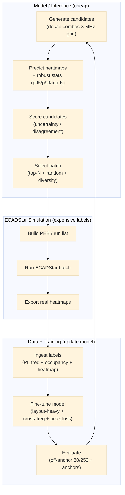

> [!caution] Archived implementation note — not for thesis citation.

## Active learning loop for PI-distribution heatmaps

This document describes a practical active-learning loop to improve **PI-distribution heatmap** accuracy at **off-anchor PI frequencies** (e.g. 80 / 250 MHz) with minimal ECADStar simulations.

### Flowchart

### Recommended acquisition signals

- **MC Dropout variance of robust peaks**: compute variance of foreground p99 (or top-K mean) across N stochastic passes.
- **Ensemble disagreement**: disagreement across multiple trained checkpoints/seeds (best uncertainty quality, higher cost).
- **Layout-path disagreement**: prioritize candidates where layout-mode decoding is unstable vs alternate decoding (targets your deployment path).
- **Frequency gap prior**: oversample between training anchors (and explicitly include known-bad MHz like 80/250).

### Metrics to track (robust to outliers)

- Avoid `max()` as a primary metric. Prefer **foreground percentiles** (`p95`, `p99`, `p99.9`) and **top-K mean**.
- Track off-anchor performance for your generation path: **`layout_cross`** error at 80/250 MHz (and compare to `encode_cross`).

### Automated pipeline implementation

See **`active_learning_pi/README.md`**. Default flow:

1. **Infer all** candidates (model-only, one-by-one scoring).
2. **Select worst** (high uncertainty / bad predictions) — skip good ones.
3. **One ECADStar batch** (single `.peb`) for labels only on bad cases.
4. **Ingest + fine-tune**.

Command: `python active_learning_pi/run_pipeline.py cycle`
