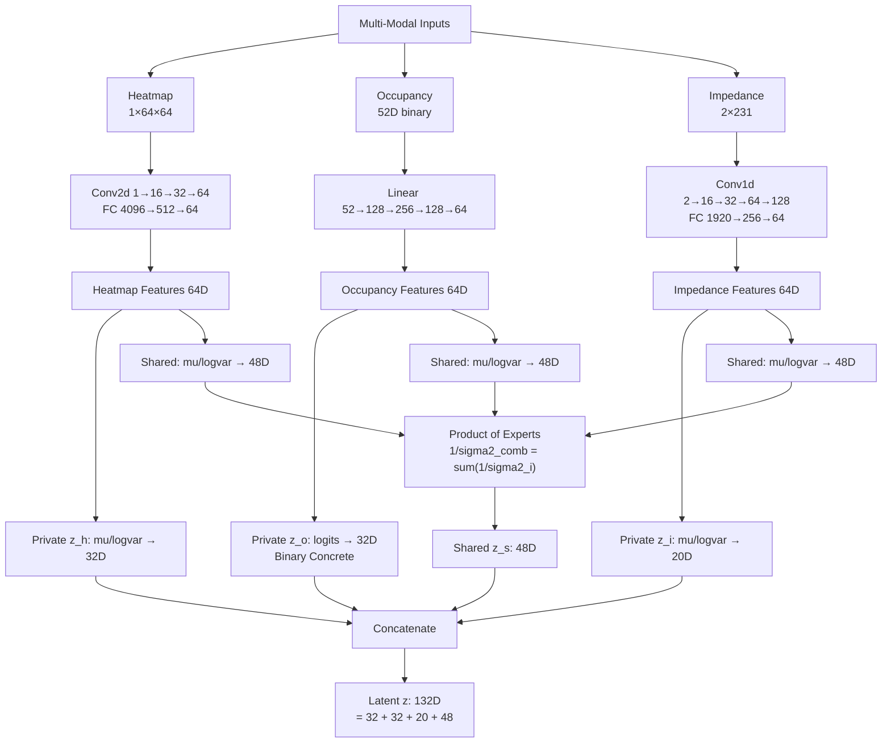
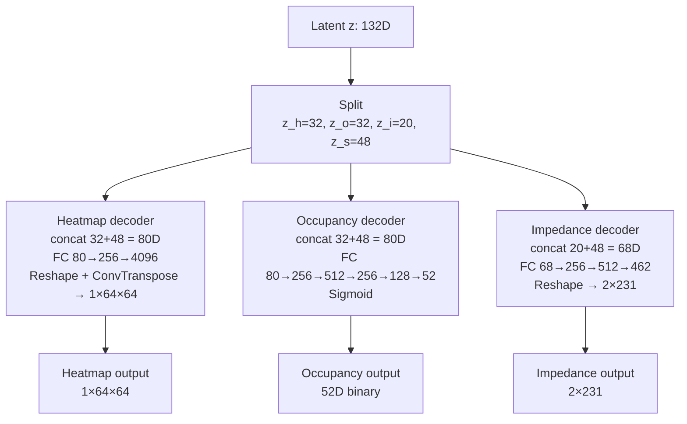
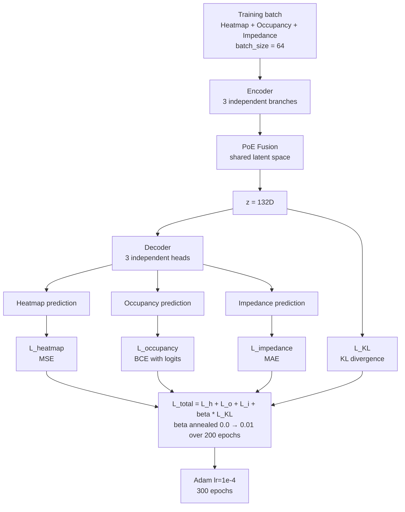
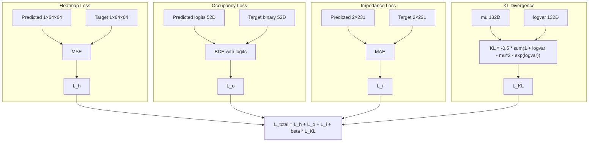

# Multi-Input Multi-Modal VAE Architecture

> 3-modality VAE — Heatmap (1×64×64) + Occupancy (52D) + Impedance (2×231)  
> Latent: **32D** (heatmap) + **32D** (occupancy) + **20D** (impedance) + **48D** (shared PoE) = **132D total**

---

## 1. Encoder — Product of Experts

Three modality branches encode independently. Each branch predicts its own private latent and a shared latent estimate. Shared estimates are fused via precision-weighted Product of Experts (PoE).

**Details:**
- **Heatmap encoder:** Conv2d (1→16→32→64, stride 2) + Flatten + FC → 64D features → private 32D (Gaussian reparameterization) + shared 48D
- **Occupancy encoder:** 4-layer MLP (52→128→256→128→64) → private 32D (Binary Concrete / straight-through) + shared 48D
- **Impedance encoder:** Conv1d on dual-channel input (raw + derivative) → FC → 64D → private 20D + shared 48D
- **PoE prior:** Unit Gaussian prior included as 4th expert

---

## 2. Decoder

Latent z is split, each private slice concatenated with the shared slice, and fed to its own decoder head.

---

## 3. Training Pipeline

---

## 4. Loss Functions

**Hyperparameters:**
| Parameter | Value |
|-----------|-------|
| Optimizer | Adam |
| Learning rate | 1e-4 |
| Epochs | 300 |
| Batch size | 64 |
| β (KL weight) | 0.0 → 0.01 (annealed epochs 0–200) |
| Heatmap loss | MSE |
| Occupancy loss | BCE with logits |
| Impedance loss | MAE |
